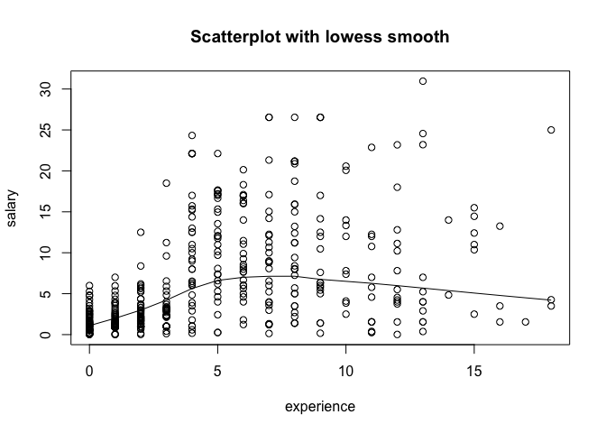

hw01-edward-zamora
================

``` r
load("data/nba2017-salary-points.RData")
```

``` r
salary= round(salary/1000000, 2)
experience = strtoi(replace(experience,experience=="R",0))
position = as.factor(position)
levels(position) = c('center','power_fwd','point_guard','small_fwd','shoot_guard')
table(position)
```

    ## position
    ##      center   power_fwd point_guard   small_fwd shoot_guard 
    ##          89          89          85          83          95

#### Scatterplot of Points and Salary

``` r
plot(points,salary,xlab="Points",ylab="Salary (in millions)",pch=20,col=2)
```


Generally, salary seems to increase as the points a player scores increases although most players are shooting under 1000 points per game.

#### Correlation between Points and Salary

*n*

``` r
n = length(player)
n
```

    ## [1] 441

$$\\bar{x}$$

``` r
x = sum(points)/n
x
```

    ## [1] 546.6054

$$\\bar{y}$$

``` r
y = sum(salary)/n
y
```

    ## [1] 6.186689

*v**a**r*(*X*)

``` r
varx=sum((points-x)^2)/(n-1)
varx
```

    ## [1] 239136.2

*v**a**r*(*Y*)

``` r
vary=sum((salary-y)^2)/(n-1)
vary
```

    ## [1] 43.19524

*s**d*(*X*)

``` r
sdx=sqrt(varx)
sdx
```

    ## [1] 489.0156

*s**d*(*Y*)

``` r
sdy=sqrt(vary)
sdy
```

    ## [1] 6.572309

*c**o**v*(*X*, *Y*)

``` r
covxy=sum((points-x)*(salary-y))/(n-1)
covxy
```

    ## [1] 2046.424

*c**o**r*(*X*, *Y*)

``` r
corxy=covxy/sdx/sdy
corxy
```

    ## [1] 0.6367296

#### Simple Linear Regression

*b*<sub>1</sub>

``` r
b_1=corxy*sdy/sdx
```

*b*<sub>0</sub>

``` r
b_0=y-b_1*x
```

$$\\hat{Y}$$

``` r
y_hat=b_0+b_1*salary
```

``` r
summary(y_hat)
```

    ##    Min. 1st Qu.  Median    Mean 3rd Qu.    Max. 
    ##   1.509   1.520   1.539   1.562   1.588   1.774

*salary*=1.5090766+0.0085576 *points* y\_hat=b\_0+b\_1\*X Slope b1 is the expected rate at which salary changes in relation to points. Intercept b0 is the expected salary when 0 points are scored.

###### Expected Salary

``` r
b_0
```

    ## [1] 1.509077

``` r
b_0+b_1*100
```

    ## [1] 2.364833

``` r
b_0+b_1*500
```

    ## [1] 5.78786

``` r
b_0+b_1*1000
```

    ## [1] 10.06664

``` r
b_0+b_1*2000
```

    ## [1] 18.62421

``` r
plot(points,salary)
abline(b_0,b_1)
lines(lowess(points,salary))
text(c(2250,2350),c(28,19),labels=c("lowess","regression"),cex=.65)
```


``` r
ei=salary-y_hat
summary(ei)
```

    ##    Min. 1st Qu.  Median    Mean 3rd Qu.    Max. 
    ## -1.4992 -0.2301  1.9610  4.6247  7.6618 29.1860

*R**S**S*

``` r
RSS = sum(ei^2)
RSS
```

    ## [1] 28113.93

*T**S**S*

``` r
TSS = sum((salary-y)^2)
TSS
```

    ## [1] 19005.91

*R*<sup>2</sup>

``` r
R2 = 1-RSS/TSS
R2
```

    ## [1] -0.4792206

``` r
plot(experience,salary,main="Scatterplot with lowess smooth")
lines(lowess(experience,salary))
```



The scatterplot show that the players who are maing most money are within the range of 5 to 10 years of experience. It appears that when most players are rookies their salary is at its lowest and then steadily decreaes after their prime years.

``` r
boxplot(salary~position)
```


The boxplots as shown tend to have a positive skewwness with few, if any, outliers. Also, all the boxplots have a similar medians at about 4 million and ranges. Although position matters somehwat, as centers seem to be making the most on average, other positions can make just as much if not more money.

``` r
library(scatterplot3d)
scatterplot3d(points,experience,salary,main="3D Scatterplot")
```


The scatterplot shows that an upward trend in salary occurs when points scored increases. However in the several cases where points are the same, years of experience positiveley effect salary.

#### Comments

The hardest part of this assignment mainly dealt with the graphs. Overall, their creation and interpretation gave me the most trouble. The easier parts of this exam involved formulas that were already given and just needed computation. It took me about 3 hours to finish the assignment. The most time consuming part was looking up how certain functions worked.
