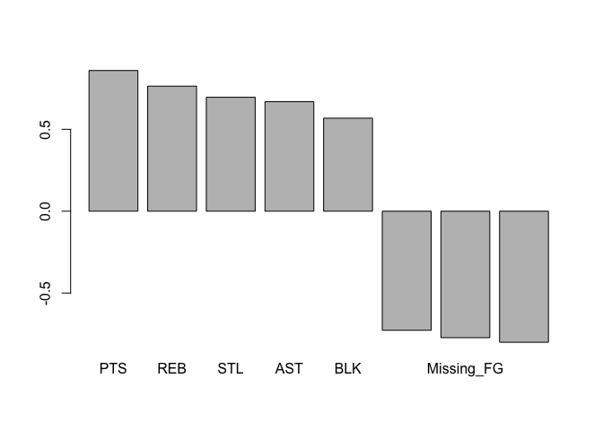

hw02-edward-zamora
================

### 2017 NBA Player Statistics

``` r
library("readr")
type = list(col_character(),col_character(),col_factor(5),col_character(),col_double())
type = append(type,rep(list(col_integer()), 19))
dat = read_csv('nba2017-player-statistics.csv',col_types=type)
```

    ## Warning in rbind(names(probs), probs_f): number of columns of result is not
    ## a multiple of vector length (arg 1)

    ## Warning: 441 parsing failures.
    ## row # A tibble: 5 x 5 col     row      col           expected actual                            file expected   <int>    <chr>              <chr>  <chr>                           <chr> actual 1     1 Position value in level set      C 'nba2017-player-statistics.csv' file 2     2 Position value in level set     PF 'nba2017-player-statistics.csv' row 3     3 Position value in level set     SG 'nba2017-player-statistics.csv' col 4     4 Position value in level set     PG 'nba2017-player-statistics.csv' expected 5     5 Position value in level set     SF 'nba2017-player-statistics.csv'
    ## ... ................. ... .......................................................................... ........ .......................................................................... ...... .......................................................................... .... .......................................................................... ... .......................................................................... ... .......................................................................... ........ ..........................................................................
    ## See problems(...) for more details.

``` r
str(dat)
```

    ## Classes 'tbl_df', 'tbl' and 'data.frame':    441 obs. of  24 variables:
    ##  $ Player      : chr  "Al Horford" "Amir Johnson" "Avery Bradley" "Demetrius Jackson" ...
    ##  $ Team        : chr  "BOS" "BOS" "BOS" "BOS" ...
    ##  $ Position    : Factor w/ 1 level "5": NA NA NA NA NA NA NA NA NA NA ...
    ##  $ Experience  : chr  "9" "11" "6" "R" ...
    ##  $ Salary      : num  26540100 12000000 8269663 1450000 1410598 ...
    ##  $ Rank        : int  4 6 5 15 11 1 3 13 8 10 ...
    ##  $ Age         : int  30 29 26 22 31 27 26 21 20 29 ...
    ##  $ GP          : int  68 80 55 5 47 76 72 29 78 78 ...
    ##  $ GS          : int  68 77 55 0 0 76 72 0 20 6 ...
    ##  $ MIN         : int  2193 1608 1835 17 538 2569 2335 220 1341 1232 ...
    ##  $ FGM         : int  379 213 359 3 95 682 333 25 192 114 ...
    ##  $ FGA         : int  801 370 775 4 232 1473 720 58 423 262 ...
    ##  $ Points3     : int  86 27 108 1 39 245 157 12 46 45 ...
    ##  $ Points3_atts: int  242 66 277 1 111 646 394 35 135 130 ...
    ##  $ Points2     : int  293 186 251 2 56 437 176 13 146 69 ...
    ##  $ Points2_atts: int  559 304 498 3 121 827 326 23 288 132 ...
    ##  $ FTM         : int  108 67 68 3 33 590 176 6 85 26 ...
    ##  $ FTA         : int  135 100 93 6 41 649 217 9 124 37 ...
    ##  $ OREB        : int  95 117 65 2 17 43 48 6 45 60 ...
    ##  $ DREB        : int  369 248 269 2 68 162 367 20 175 213 ...
    ##  $ AST         : int  337 140 121 3 33 449 155 4 64 71 ...
    ##  $ STL         : int  52 52 68 0 9 70 72 10 35 26 ...
    ##  $ BLK         : int  87 62 11 0 7 13 23 2 18 17 ...
    ##  $ TO          : int  116 77 88 0 25 210 79 4 68 39 ...
    ##  - attr(*, "problems")=Classes 'tbl_df', 'tbl' and 'data.frame': 441 obs. of  5 variables:
    ##   ..$ row     : int  1 2 3 4 5 6 7 8 9 10 ...
    ##   ..$ col     : chr  "Position" "Position" "Position" "Position" ...
    ##   ..$ expected: chr  "value in level set" "value in level set" "value in level set" "value in level set" ...
    ##   ..$ actual  : chr  "C" "PF" "SG" "PG" ...
    ##   ..$ file    : chr  "'nba2017-player-statistics.csv'" "'nba2017-player-statistics.csv'" "'nba2017-player-statistics.csv'" "'nba2017-player-statistics.csv'" ...
    ##  - attr(*, "spec")=List of 2
    ##   ..$ cols   :List of 24
    ##   .. ..$ Player      : list()
    ##   .. .. ..- attr(*, "class")= chr  "collector_character" "collector"
    ##   .. ..$ Team        : list()
    ##   .. .. ..- attr(*, "class")= chr  "collector_character" "collector"
    ##   .. ..$ Position    :List of 3
    ##   .. .. ..$ levels    : num 5
    ##   .. .. ..$ ordered   : logi FALSE
    ##   .. .. ..$ include_na: logi FALSE
    ##   .. .. ..- attr(*, "class")= chr  "collector_factor" "collector"
    ##   .. ..$ Experience  : list()
    ##   .. .. ..- attr(*, "class")= chr  "collector_character" "collector"
    ##   .. ..$ Salary      : list()
    ##   .. .. ..- attr(*, "class")= chr  "collector_double" "collector"
    ##   .. ..$ Rank        : list()
    ##   .. .. ..- attr(*, "class")= chr  "collector_integer" "collector"
    ##   .. ..$ Age         : list()
    ##   .. .. ..- attr(*, "class")= chr  "collector_integer" "collector"
    ##   .. ..$ GP          : list()
    ##   .. .. ..- attr(*, "class")= chr  "collector_integer" "collector"
    ##   .. ..$ GS          : list()
    ##   .. .. ..- attr(*, "class")= chr  "collector_integer" "collector"
    ##   .. ..$ MIN         : list()
    ##   .. .. ..- attr(*, "class")= chr  "collector_integer" "collector"
    ##   .. ..$ FGM         : list()
    ##   .. .. ..- attr(*, "class")= chr  "collector_integer" "collector"
    ##   .. ..$ FGA         : list()
    ##   .. .. ..- attr(*, "class")= chr  "collector_integer" "collector"
    ##   .. ..$ Points3     : list()
    ##   .. .. ..- attr(*, "class")= chr  "collector_integer" "collector"
    ##   .. ..$ Points3_atts: list()
    ##   .. .. ..- attr(*, "class")= chr  "collector_integer" "collector"
    ##   .. ..$ Points2     : list()
    ##   .. .. ..- attr(*, "class")= chr  "collector_integer" "collector"
    ##   .. ..$ Points2_atts: list()
    ##   .. .. ..- attr(*, "class")= chr  "collector_integer" "collector"
    ##   .. ..$ FTM         : list()
    ##   .. .. ..- attr(*, "class")= chr  "collector_integer" "collector"
    ##   .. ..$ FTA         : list()
    ##   .. .. ..- attr(*, "class")= chr  "collector_integer" "collector"
    ##   .. ..$ OREB        : list()
    ##   .. .. ..- attr(*, "class")= chr  "collector_integer" "collector"
    ##   .. ..$ DREB        : list()
    ##   .. .. ..- attr(*, "class")= chr  "collector_integer" "collector"
    ##   .. ..$ AST         : list()
    ##   .. .. ..- attr(*, "class")= chr  "collector_integer" "collector"
    ##   .. ..$ STL         : list()
    ##   .. .. ..- attr(*, "class")= chr  "collector_integer" "collector"
    ##   .. ..$ BLK         : list()
    ##   .. .. ..- attr(*, "class")= chr  "collector_integer" "collector"
    ##   .. ..$ TO          : list()
    ##   .. .. ..- attr(*, "class")= chr  "collector_integer" "collector"
    ##   ..$ default: list()
    ##   .. ..- attr(*, "class")= chr  "collector_guess" "collector"
    ##   ..- attr(*, "class")= chr "col_spec"

``` r
type = c('character','character','factor','character','double')
type = append(type,rep.int('integer',19))
dat <- read.csv('nba2017-player-statistics.csv', stringsAsFactors = FALSE, colClasses = type)
str(dat)
```

    ## 'data.frame':    441 obs. of  24 variables:
    ##  $ Player      : chr  "Al Horford" "Amir Johnson" "Avery Bradley" "Demetrius Jackson" ...
    ##  $ Team        : chr  "BOS" "BOS" "BOS" "BOS" ...
    ##  $ Position    : Factor w/ 5 levels "C","PF","PG",..: 1 2 5 3 4 3 4 5 4 2 ...
    ##  $ Experience  : chr  "9" "11" "6" "R" ...
    ##  $ Salary      : num  26540100 12000000 8269663 1450000 1410598 ...
    ##  $ Rank        : int  4 6 5 15 11 1 3 13 8 10 ...
    ##  $ Age         : int  30 29 26 22 31 27 26 21 20 29 ...
    ##  $ GP          : int  68 80 55 5 47 76 72 29 78 78 ...
    ##  $ GS          : int  68 77 55 0 0 76 72 0 20 6 ...
    ##  $ MIN         : int  2193 1608 1835 17 538 2569 2335 220 1341 1232 ...
    ##  $ FGM         : int  379 213 359 3 95 682 333 25 192 114 ...
    ##  $ FGA         : int  801 370 775 4 232 1473 720 58 423 262 ...
    ##  $ Points3     : int  86 27 108 1 39 245 157 12 46 45 ...
    ##  $ Points3_atts: int  242 66 277 1 111 646 394 35 135 130 ...
    ##  $ Points2     : int  293 186 251 2 56 437 176 13 146 69 ...
    ##  $ Points2_atts: int  559 304 498 3 121 827 326 23 288 132 ...
    ##  $ FTM         : int  108 67 68 3 33 590 176 6 85 26 ...
    ##  $ FTA         : int  135 100 93 6 41 649 217 9 124 37 ...
    ##  $ OREB        : int  95 117 65 2 17 43 48 6 45 60 ...
    ##  $ DREB        : int  369 248 269 2 68 162 367 20 175 213 ...
    ##  $ AST         : int  337 140 121 3 33 449 155 4 64 71 ...
    ##  $ STL         : int  52 52 68 0 9 70 72 10 35 26 ...
    ##  $ BLK         : int  87 62 11 0 7 13 23 2 18 17 ...
    ##  $ TO          : int  116 77 88 0 25 210 79 4 68 39 ...

``` r
dat$Experience=strtoi(replace(dat$Experience,dat$Experience=='R',0))
```

### Performance of Players

#### EFF Calculation

``` r
dat$Missed_FG=dat$FGA-dat$FGM
dat$Missed_FT=dat$FTA-dat$FTM
dat$PTS <- dat$Points2*2+dat$Points3*3+dat$FTM
dat$REB = dat$OREB+dat$DREB
dat$MPG= dat$MIN/dat$GP
dat$EFF <- (dat$PTS+dat$REB+dat$AST+dat$STL+dat$BLK-dat$Missed_FG-dat$Missed_FT-dat$TO)/dat$GP
summary(dat$EFF)
```

    ##    Min. 1st Qu.  Median    Mean 3rd Qu.    Max. 
    ##  -0.600   5.452   9.090  10.137  13.247  33.840

``` r
hist(dat$EFF, col=2, xlab = "EFF", main = "Histogram of EFF")
```


``` r
library("dplyr")
```

    ## 
    ## Attaching package: 'dplyr'

    ## The following objects are masked from 'package:stats':
    ## 
    ##     filter, lag

    ## The following objects are masked from 'package:base':
    ## 
    ##     intersect, setdiff, setequal, union

#### Top 10 Players by EFF

``` r
select(slice(arrange(dat,desc(EFF)),1:10),Player,Team,Salary,EFF)
```

    ## # A tibble: 10 x 4
    ##                   Player  Team   Salary      EFF
    ##                    <chr> <chr>    <dbl>    <dbl>
    ##  1     Russell Westbrook   OKC 26540100 33.83951
    ##  2          James Harden   HOU 26540100 32.34568
    ##  3         Anthony Davis   NOP 22116750 31.16000
    ##  4          LeBron James   CLE 30963450 30.97297
    ##  5    Karl-Anthony Towns   MIN  5960160 30.32927
    ##  6          Kevin Durant   GSW 26540100 30.19355
    ##  7 Giannis Antetokounmpo   MIL  2995421 28.37500
    ##  8      DeMarcus Cousins   NOP 16957900 27.94118
    ##  9          Jimmy Butler   CHI 17552209 25.60526
    ## 10      Hassan Whiteside   MIA 22116750 25.36364

#### Players with Negative EFF

``` r
select(filter(dat,EFF<0),Player)
```

    ##            Player
    ## 1 Patricio Garino

#### EFF Correlations

``` r
correlation = c(
cor(dat$EFF,-dat$Missed_FG),
cor(dat$EFF,-dat$Missed_FT),
cor(dat$EFF,-dat$TO),
cor(dat$EFF,dat$PTS),
cor(dat$EFF,dat$REB),
cor(dat$EFF,dat$AST),
cor(dat$EFF,dat$STL),
cor(dat$EFF,dat$BLK)
)
names=c('Missing_FG','Missing_FT','TO','PTS','REB','AST','STL','BLK')
```

``` r
correlations = arrange(data.frame(names,correlation),desc(correlation))
correlations
```

    ##        names correlation
    ## 1        PTS   0.8588644
    ## 2        REB   0.7634501
    ## 3        STL   0.6957286
    ## 4        AST   0.6689232
    ## 5        BLK   0.5679571
    ## 6 Missing_FT  -0.7271456
    ## 7 Missing_FG  -0.7722477
    ## 8         TO  -0.8003289

``` r
barplot(correlations$correlation,names.arg = correlations$names)
```



### Efficiency and Salary

``` r
scatter.smooth(dat$EFF,dat$Salary,xlab='EFF',ylab='Salary', main='EFF Scatterplot for NBA')
```


``` r
cor(dat$EFF,dat$Salary)
```

    ## [1] 0.655624

Since the correlations is 0.655624, there appears to be a relativeley strong positive relationship between the two variables meaning that an increase in a player's EFF will likeley result in a higher salary.

``` r
players2 <- dat[dat$MPG>20,]
scatter.smooth(players2$EFF,players2$Salary,xlab='EFF',ylab='Salary',main='EFF Scatterplot for NBA Rookies')
```


``` r
cor(players2$EFF,players2$Salary)
```

    ## [1] 0.5367224

Through their correlation coefficient, it appears that as players become more experienced and receive more minutes per game, the less their salaries are affected by their EFF. Therefore, it could be said that the salary of rookies is more susceptible to how well the player performs.

### Comments and Reflections

The hardest part of the assignment was creating the initial data frame using both methods since the syntax for the 'readr' package was somewhat difficult to understand. Other than that, the next most challenging aspect ad the most time consuming part was just looking up the syntax of functions that we have already used which was not very hard at all. This assignment took me roughly 4 hours to complete with no help. The only part of the assignment I'm still not to sure about is creating a data frame using the 'readr' method as the structure of the object was fine although I did receive a weird message during execution.
