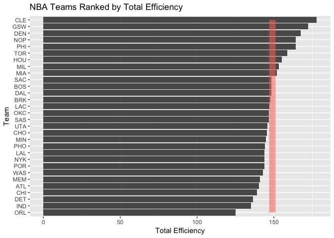

hw03-edward-zamora
================

``` r
library('dplyr')
```

    ## 
    ## Attaching package: 'dplyr'

    ## The following objects are masked from 'package:stats':
    ## 
    ##     filter, lag

    ## The following objects are masked from 'package:base':
    ## 
    ##     intersect, setdiff, setequal, union

``` r
library('ggplot2')
```

``` r
dat <- read.csv("../data/nba2017-teams.csv")
```

``` r
ggplot(dat,aes(x=reorder(team,salary),y=salary))+geom_bar(stat ='identity')+coord_flip()+geom_line(aes(x=team,y=mean(salary),group=1,size=2,col="#FF0000",alpha=.7))+xlab("Team")+ylab("Salary (in millions)")+theme(legend.position = "none")+ggtitle('NBA Teams Ranked by Total Salary')
```


Teams are ranked by their total salaries in descending order. The Cleveland Cavaliers have the highest total salary at 125.79 million dollars while the Philadelphia 76ers have the lowest total at 55.78 million dollars. The average total salary of all NBA teams in 2017 was 90.95 million dollars.

``` r
ggplot(dat,aes(x=reorder(team,points),y=points))+geom_bar(stat ='identity')+coord_flip()+geom_line(aes(x=team,y=mean(points),group=1,size=2,col="#FF0000",alpha=.7))+xlab("Team")+ylab("Total Points")+theme(legend.position = "none")+ggtitle('NBA Teams Ranked by Total Points')
```


Teams are ranked by total points scored throughout the 2017 season. The Golden State Warriors scored the most with 9473 points while the Sacramento Kings scored the lowest with only 6348 points. The average number of points scored by all teams in the NBA this season is 8035.1.

``` r
ggplot(dat,aes(x=reorder(team,efficiency),y=efficiency))+geom_bar(stat ='identity')+coord_flip()+geom_line(aes(x=team,y=mean(efficiency),group=1,size=2,col="#FF0000",alpha=.7))+xlab("Team")+ylab("Total Efficiency")+theme(legend.position = "none")+ggtitle('NBA Teams Ranked by Total Efficiency')
```



Here teams are ranked by total efficiency calculated using team statistics from the 2017 season. The Cleveland Cavaliers are the most efficient at 177.8585138 while the Orlando Magic are the least efficient at 125.1406172. The average efficiency of all teams in the NBA this season is 149.01.

``` r
pr <- prcomp(select(dat,points3,points2,free_throws,off_rebounds,def_rebounds,assists,steals,blocks,turnovers,fouls),scale. = TRUE)
eg = pr$sdev^2
m <- function(x){sum((eg/sum(eg))[1:x])}
eigs = data.frame(eigenvalue=round(eg,4),prop=round(eg/sum(eg),4),cumprop=round(sapply(1:10,m),4))
teampr <-data.frame(team=dat$team,pr$x[,1:2])
```

``` r
ggplot(teampr,aes(x=PC1,y=PC2))+geom_point(aes(alpha=0))+geom_text(aes(label=team))+theme(legend.position = "none")+ggtitle('PCA Plot (PC1 and PC2)')+geom_line(aes(x=0))+geom_line(aes(y=0))
```


``` r
pr$rotation[,1:2]
```

    ##                    PC1         PC2
    ## points3      0.1121782 -0.65652993
    ## points2      0.3601766  0.32892544
    ## free_throws  0.3227564 -0.17651228
    ## off_rebounds 0.3029366  0.35931603
    ## def_rebounds 0.3719432 -0.12808273
    ## assists      0.3125312 -0.44134618
    ## steals       0.3447256 -0.03540585
    ## blocks       0.3162237  0.06131890
    ## turnovers    0.3353958 -0.02169833
    ## fouls        0.3072548  0.28954426

``` r
teampr = mutate(teampr,s=100*(PC1-min(teampr$PC1))/(max(teampr$PC1)-min(teampr$PC1)))

ggplot(teampr,aes(x=reorder(team,s),y=s))+geom_bar(stat ='identity')+coord_flip()+xlab("Team")+ylab("First PC (scaled from 0 to 100)")+theme(legend.position = "none")+ggtitle('NBA Teams Ranked by Scaled PC1')
```


Here teams are ranked by the calculated PC1 which has been scaled to a value between 0 and 100. The Golden State Warriors have the highest index at 4.9580722 while the Sacramento Kings have the lowest at -5.5291364.

#### Comments

This assignment took about 5 hours to complete. The most time consuming part was cleaning the raw data although it wasn't too difficult. The hardest part that was covered in lecture was obtaining the values for the PCA and the easiest part not covered with formatting the graphs.
