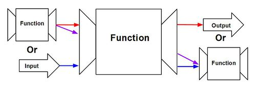
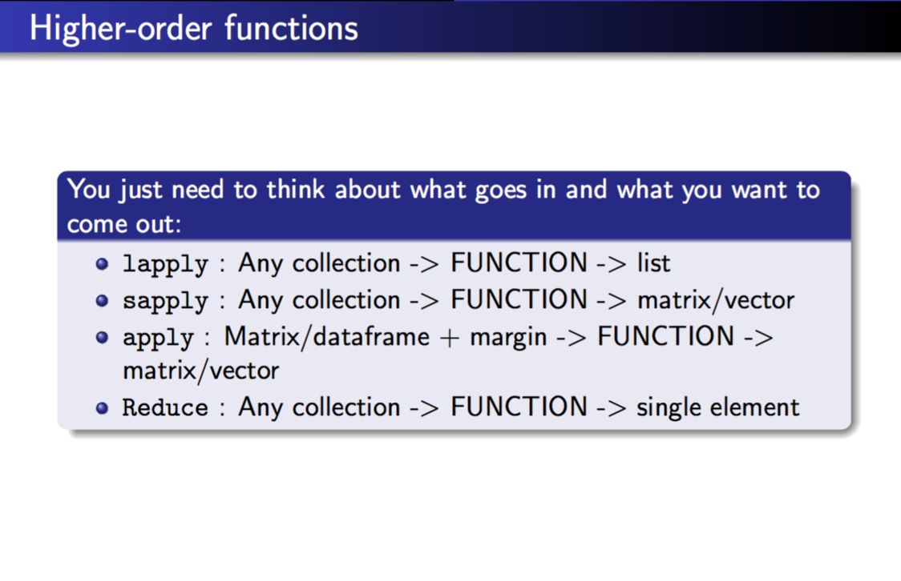

```{r setup, include=FALSE}
knitr::opts_chunk$set(echo = TRUE)
```

During this course we have already begun to create functions which manipulate inputs in the form of either a vector or a scalar and return either vectors or scalars. However, a 
powerful tool that any good programmer should be familiar with is a higher order function.
Higher order functions are any functions that take in an input value (scalar or vector) or
an input function and return functions or sometimes (in the case of input functions) scalars or vectors <sup>[1](#h)</sup>.




In order to be classified as a higher order function, a function must meet at least one of the following two criterion:

####1.The function returns another function

Example: Let's say that I want to make several functions that multiply a single input value, x, by a given amount specific to each function. The simplest way by which this can be achieved is to create several multiply function as in the following code:

```{r}
mult2 <- function(x) x*2
mult4 <- function(x) x*4
mult8 <- function(x) x*8
```

While simple enough where this is probably the most efficient way to construct these fucntions, if I were to make the operation more complex and/or increase the number of functions I wanted to create, this notation could become a little tedious. Instead, I could write a general function that performs the desired operation and 'tweak' it according to the actual function I want. This is the basis for higher order functions. Using this mentality, I can write code as shown below.

```{r}
multiplier <- function(x,y) x*y
multiplier(5,8)


mult8 <- function(x) multiplier(x,8)
mult4 <- function(x) multiplier(x,4)
mult2 <- function(x) multiplier(x,2)

mult8(5)
mult4(6)
mult2(7)
```


While this notation does indeed work, the multiplier function is not true higher order function since it neither takes or returns a function. In fact, it may be argued that it'd be just as easy to evaluate the first function by itself rather than use the second which only calls the first, even if the operations in the multiplier function were to become more complex. So, even though creating new functions using this model is an improvement, it is not optimal and I still have to deal with lots of repetition by declaring 'function(x)' every time. Instead, its easier this way:

```{r}
multiplier <- function(x){
  function(y){
    x*y
  }
}

mult8 <- multiplier(8)
mult4 <- multiplier(4)
mult2 <- multiplier(2)

#mult8 is now a function
mult8

mult8(5)
mult4(6)
mult2(7)

#Instead of creating a new function, we can use an unassigned function in the following notation.
multiplier(8)(5)
```
<sup>[2](#i)</sup>

Although maybe a bit confusing at first, in general, functions defined within another function (inner functions) have access to any variable within the parent function.
We can see that any inner function returned from the higher order 'multiplier' function has access to the initial input, x. When this inner function is then called, it uses its own input, y, along with x<sup>[3](#j)</sup>. Here, as long as I have a properly designed general function, I can create new functions as seemlessly as possible, no matter the complexity. 

####2. Takes a function as argument

But, what if I wanted to change operation and not the operand? Just as function can take an input and return a function as in the above example, a function can take in function and return new function. 

Example: Let's say I wanted to create a function that's able to manipulate any value by pi (i.e. add, subtract, divide, or multiply by pi). Instead of creating new functions to achieve the desired outcome, I can simply use a higher order function that encompasses all 4 and changes its operation accordingly.

```{r}
by8 <- function(f){
  function(x){
    f(x,8)
  }
}


multiplier <- function(x,y) x*y

mult8 <- by8(multiplier)


#By defining a new operation we can make other functions as well.
adder <- function(x,y) x+y

add8 <- by8(adder)

mult8(5)
add8(7)

```

Similarly, a function can be taken as an input and return an actual value. R contains many of these functions already such as Reduce and Filter<sup>[4](#k)</sup>.

Example: Now let's say that I have a vector of values in ascending order, but I only want the values that are prime numbers. I can achieve this using R's built in filter function which is a higher order function that takes in a function, f, and a vector of values, v, and eliminates all values in v where calling f on v results in a False boolean value.
  
```{r}  
eg <- c(1,4,7,19,22,29)


#Returns True if x is a prime number, and False otherwise.  
isPrime <- function(x){
  if (x==1){
    return(TRUE)
  }else if(x==2){
    return(TRUE)
  }
  for (i in 2:(x-1)){
    if (x%%i==0){
      return(FALSE)
    }
  }
  return(TRUE)
}

Filter(isPrime,eg)
```

Practical Example:

So far, when discussing higher order functions, we have used relatively simple examples that don't really demonstrate just how useful this tool can be. To show the effectiveness of higher order functions, we will create several different polynomial functions:


<u>Polynomials</u>

$x^2+2x+1$

$x^5+9x^3+7x+4$

$x^6+x^3+x$

$x$

$3x^3+2x^2+x$

```{r}
#Hard Way
p1 <- function(x) x^2+2*x+1
p2 <- function(x) x^5+9*x^3+7*x+4
p3 <- function(x) x^6+x^3+x
p4 <- function(x) x
p5 <- function(x) 3*x^3+2*x^2+x

p3(2)
```
Hard Way: Works fine for limited number of polynomials but impractical to write every polynomial, especially as number increases.

```{r}
#Medium Way
#
#' @param degree degree of polynomial
#' @param coef vector of coeffecients with length degree+1 in order of decreasing degree.
polynomial <- function(x,degree,coef){
  total <- 0
  for (n in degree:0){
    total <- total + coef[degree-n+1]*x^n
  }
  return(total)
}

p1 <- function(x) polynomial(x,2,c(1,2,1))
p2 <- function(x) polynomial(x,5,c(1,0,9,0,7,4))
p3 <- function(x) polynomial(x,6,c(1,0,0,1,0,1,0))
p4 <- function(x) polynomial(x,1,c(1,0))
p5 <- function(x) polynomial(x,3,c(3,2,1,0))

p3(2)

#Side note: Redefining polynomial function after p_ function has been declared will also alter any call to any p_ function after, unlike a higher order function in which redefining the polynomial function will not affect any existing p_ function.

polynomial <- function(x,degree,coef) x
p3(2)
``` 
Medium Way: Much better but not best since 'function(x)' has to be reapeatedly declared and overall just 'clunky'.

```{r}
#Easy Way
polynomial <- function(degree,coef){
  function(x){
    total <- 0
    for (n in degree:0){
      total <- total + coef[degree-n+1]*x^n
    }
    return(total)
  }
}

p1 <- polynomial(2,c(1,2,1))
p2 <- polynomial(5,c(1,0,9,0,7,4))
p3 <- polynomial(6,c(1,0,0,1,0,1,0))
p4 <- polynomial(1,c(1,0))
p5 <- polynomial(3,c(3,2,1,0))

p3(2)
```
Easy Way: Best since easily understood with any unnecessary notation eliminated.

###apply, lapply, sapply:

<sup>[5](#l)</sup>



Three common higher order functions already built into the R language that are worth mentioning are the apply, sapply, and lapply functions. When dealing with nonvectorized functions (functions that don't automatically apply to every value in a vector), as in custom functions, that need to be applied over an array of values, these functions are extremeley useful. All the user needs is a set of values and a function to be passed in as arguments and the apply functions will return the values when passed thorugh the input function in some predertermined data type (list, vector, etc)<sup>[6](#m)</sup>. 
  
(Documentation for 'apply' functions can be found [here](https://www.r-bloggers.com/apply-lapply-rapply-sapply-functions-in-r/).)


In conclusion, higher order functions are extremeley useful tools that allow simplicity when writing and reading code. Higher order functions not only allow a certain amount of freedom for its users in terms of eliminating nonsessential repetitions in code, but also increase functionality in realtion to how existing functions are called and executed.


###References:

<a name="h">1</a>:https://en.wikipedia.org/wiki/Higher-order_function

<a name="i">2</a>:https://renkun.me/2014/03/15/a-brief-introduction-to-higher-order-functions-in-r/

<a name="j">3</a>:https://eloquentjavascript.net/05_higher_order.html

<a name="k">4</a>:http://stat.ethz.ch/R-manual/R-devel/library/base/html/funprog.html

<a name="l">5</a>:http://www.rmanchester.org/presentations/2013/05/ManchesterR_-_FP_in_R_-_David_Springate_-_20130502.pdf

<a name="m">6</a>:https://www.r-bloggers.com/how-to-use-vectorization-to-streamline-simulations/

<a name="n">7</a>:https://www.r-bloggers.com/apply-lapply-rapply-sapply-functions-in-r/

