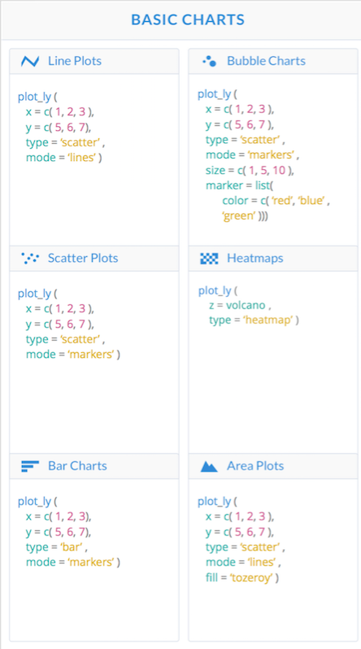

```{r setup, include=FALSE}
knitr::opts_chunk$set(echo = TRUE)
```


Over the span of this course, we have mainly covered two packages for the purpose of data visulization: __*ggplot*__ and __*ggvis*__. Although both packages are extremely useful for the purpose of data visualization, each comes with its own pros and cons. While *ggplot* is a nice, easy-to-use package for basic data visualization, its lack of interactivity can be somewhat limiting for both developers and users. Conversely, *ggvis* is a package that allows for much more complex visualizations since it implements interactive charts and graphs although, in my opinion, at the expense of "user-friendliness." The purpose of this post is to introduce a somewhat middle ground in the form of __*plotly*__, an R packcage that creates interactive data visualizations in a syntax that is relatively similar to that of *ggplot*.

###Background:
Created in 2012, Plotly is an open source visualization library specializing in interactive graphing and headquartered in Montreal, Canada.<sup>[1](#a)</sup> As a result of its construction using the Python scripting language, the package is very much language agnostic, meaning that instead of being saved as a traditional .png file, all charts are stored as JSON files which can be read by a wide variety of languages such as JavaScript and R. Because of this nontraditional storage form, all graphs and charts created using *plotly* are embeddable and editable on the web, so unlike ggvis, interactive graphs can be run on knit html files.<sup>[2](#b)</sup> Below are a few examples to familiarize yourself with *plotly* syntax and compare its usability with that of *ggplot* and *ggvis*.


```{r}
#Packages needed for Examples.
library(plotly)
library(ggplot2)
library(ggvis)
```

###Basic Syntax:

<p align='center'>
 
</p>


Plotly constructs its graphs using two main functions: <mark>plot_ly</mark> and <mark>ggplotly</mark>. The first, <mark>plot_ly</mark>, is a visualization function like we've seen before that takes in a data frame, x and/or y coordinate mappings, type of visualization, and various other optional arguments to customize your graph.<sup>[3](#c)</sup>

###Example 1) Distribution of Weights

**Goal: Create a graph that shows distribution of car weights using the built-in mtcars data set's wt column.**
```{r}
#Graph using 'ggplot2'.
ggplot(data = mtcars,aes(x = wt))+geom_histogram(binwidth = .6)

#Graph using 'ggvis'.
ggvis(data=mtcars,x=~wt)%>%
layer_histograms(width = .6)

#Graphs using 'plot_ly'.
plot_ly(data=mtcars,x=~wt,type = "histogram",xbins=list(start=1.5,end=6,size=.6))
```
As you can see, <mark>plot_ly</mark> eliminates the need for secondary functions like <mark>geom_histogram</mark> or <mark>layer_histograms</mark> by declaring its type and format within the function itself. Also, as in the example above, all variable attributes, such as those declared in xbins, must be declared in the form of a list.<sup>[4](#d)</sup> Additionaly, functions like <mark>layout</mark> can be used with <mark>plot_ly</mark> for greater graphic control.

```{r}
plot_ly(data=mtcars,x=~wt,type = "histogram",xbins=list(start=1.5,end=6,size=.6))%>%
  layout(xaxis=list(title = 'Car Weights',showgrid=TRUE,nticks=10),
         yaxis=list(title = 'Frequency', showgrid=TRUE,nticks=24))
```


Notice that all graph accurately depict the given data in accordance with the desire binwidth of .6. However, as you can see if you alter the binwidth of the given *plotly* graph, failure to alter the starting and endpoints as well will result in a slightly different graph. In order to circumvent this problem, plotly contains a second visualization function <mark>ggplotly</mark> which takes in any *ggplot* chart as an argument and displays it in an interactive format.

```{r}
#Assign ggplot graph to 'ggplotly'.
plot <- ggplot(data = mtcars,aes(x = wt))+geom_histogram(binwidth = .6)
#Call ggplotly on plot object.
ggplotly(plot)
```

We can then manipulate the newly created *plotly* object just as before<su>[5](#e)</sup>:
```{r}
ggplotly(plot)%>%
  layout(xaxis=list(title = 'Car Weights',showgrid=TRUE),
         yaxis=list(title = 'Frequency', showgrid=TRUE))
```

For the most part, plotly is a very simple yet powerful package. Now, for a more complex example:

###Example 2) Passengers per Month by Year

**Goal: Show visualization of number of passengers per month for every year using built-in AirPassengers data.** 

For this example, we will be using a scatterplot to show number of passengers per month, setting the months as the x-axis and number of people as the y-axis.

First, since AirPassengers is not in the data frame form that we want, we need to clean the data. Create a new data frame passngers with the first column being the vector of months and each subsequent column the vector of passengers by month for every year.
```{r}
#For appearances abbreviate month names.
month.name <- substr(month.name,1,3)

passengers=data.frame(Month=month.name)
n=1
for (year in 1949:1960){
passengers[as.character(year)]=AirPassengers[n:(n+11)]
n=n+12
}

head(passengers)
```

####1) *GGPlot*
The first method we will consider involves the use of *ggplot*. 
```{r}
ggplot(passengers,aes(Month,`1949`,color=Month))+geom_point()
ggplot(passengers,aes(Month,`1950`,color=Month))+geom_point()
```

Since this package is not interactive, the only possible way to visualize the number of passengers by month for each year is to create a new chart for each subsequent year, which is not very efficient.


####2)*GGvis*
The second method we will consider is using the *ggvis* library to create an interactive scatterplot that changes its points according to the chosen year.
```{r}
#slider that returns column name of passengers according to desired year.
slider <- input_slider(1949,1960,1950, map=function(x) {as.name(names(passengers[x-1947]))})

ggvis(passengers,x = ~Month,
  y=slider) %>%
layer_points(fill=~Month)
```
This interactive graph is much more efficient than the previous rendering and does exactly as it is intended when run through the console. However, since ggvis was designed mainly as a tool for shiny apps, running this code on a knitted html file will result in a static graph.

####3)*Plotly*

To use *plotly*, as you will later see, it will be much easier first reorganize the data frame in only 3 columns: Number(the number of passengers), Month, and Year. (Although it may seem counterproductive to reorganize the data at first, realize that the the data analysis cycle is not linear and "re-cleaning" data to suit the developer's needs is common.)

```{r}
passengers = data.frame(Number=AirPassengers)
passengers['Month']=month.name
a <- rep(1949,12)
for (year in 1950:1960){
a=c(a,rep(year,12))}
passengers['Year']=a

head(passengers)
```

Once we have "re-cleaned" the data, we are ready to graph it using *plotly*. In this case, it will be easier to construct our chart using *ggplot* first. When using <mark>ggplotly</mark>, a slider will automatically be created according to the values dictated in the aesthetic element 'frame' of our initial plot, p. Statically, the graph will show all possible points of the data frame but, interactively (when we run p through ggplotly), it will switch from year to year.
```{r}

plot <- ggplot(passengers, aes(x=Month, y=Number,color=Month)) +
  geom_point(aes(frame=Year)) 
plot
ggplotly(plot)
```

Note: Although in this case it is more efficient to use *plotly*, there are still drawbacks. For example, if we were to construct the chart using <mark>plot_ly</mark> we would need to define all parameters for the slider ourselves which is a somewhat complex process you can read more about [here](https://plot.ly/r/sliders/).<sup>[6](#f)</sup> 


  In conclusion, *plotly* is a very useful and powerful package which allows not only for the creation of interactive plots but also the conversion of static charts into an interactive format.Its ability to run on multiple platforms allows for greater collaboration across multiple programming languages as well.While I have covered some of the more basic functions of *plotly*, there are many more features that exist from basic barcharts to complex interactive maps and 3D graphs which will be useful for more advanced data analysis.<sup>[7](#g)</sup> 


###References:

<a name="a">1</a>:https://en.wikipedia.org/wiki/Plotly

<a name="b">2</a>:https://plot.ly/d3-js-for-r-and-shiny-charts/

<a name="c">3</a>:https://images.plot.ly/plotly-documentation/images/r_cheat_sheet.pdf

<a name="d">4</a>:https://plot.ly/r/#basic-charts

<a name="e">5</a>:https://plot.ly/r/reference/

<a name="f">6</a>:https://plot.ly/r/sliders/

<a name="g">7</a>:https://moderndata.plot.ly/interactive-r-visualizations-with-d3-ggplot2-rstudio/
