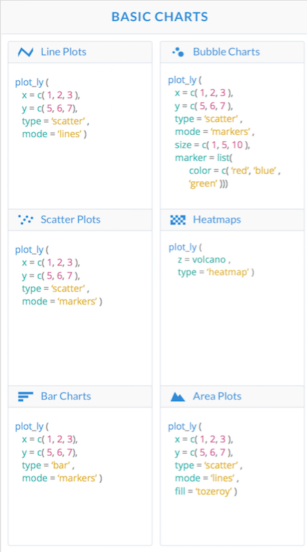

More Data Visualization: A Brief Introduction to Plotly
================

Over the span of this course, we have mainly covered two packages for the purpose of data visulization: ***ggplot*** and ***ggvis***. Although both packages are extremely useful for the purpose of data visualization, each comes with its own pros and cons. While *ggplot* is a nice, easy-to-use package for basic data visualization, its lack of interactivity can be somewhat limiting for both developers and users. Conversely, *ggvis* is a package that allows for much more complex visualizations since it implements interactive charts and graphs although, in my opinion, at the expense of "user-friendliness." The purpose of this post is to introduce a somewhat middle ground in the form of ***plotly***, an R packcage that creates interactive data visualizations in a syntax that is relatively similar to that of *ggplot*.

### Background:

Created in 2012, Plotly is an open source visualization library specializing in interactive graphing and headquartered in Montreal, Canada.<sup>[1](#a)</sup> As a result of its construction using the Python scripting language, the package is very much language agnostic, meaning that instead of being saved as a traditional .png file, all charts are stored as JSON files which can be read by a wide variety of languages such as JavaScript and R. Because of this nontraditional storage form, all graphs and charts created using *plotly* are embeddable and editable on the web, so unlike ggvis, interactive graphs can be run on knit html files.<sup>[2](#b)</sup> Below are a few examples to familiarize yourself with *plotly* syntax and compare its usability with that of *ggplot* and *ggvis*.

``` r
#Packages needed for Examples.
library(plotly)
```

    ## Loading required package: ggplot2

    ## 
    ## Attaching package: 'plotly'

    ## The following object is masked from 'package:ggplot2':
    ## 
    ##     last_plot

    ## The following object is masked from 'package:stats':
    ## 
    ##     filter

    ## The following object is masked from 'package:graphics':
    ## 
    ##     layout

``` r
library(ggplot2)
library(ggvis)
```

    ## 
    ## Attaching package: 'ggvis'

    ## The following objects are masked from 'package:plotly':
    ## 
    ##     add_data, hide_legend

    ## The following object is masked from 'package:ggplot2':
    ## 
    ##     resolution

### Basic Syntax:

<p align="center">

</p>
Plotly constructs its graphs using two main functions: <mark>plot\_ly</mark> and <mark>ggplotly</mark>. The first, <mark>plot\_ly</mark>, is a visualization function like we've seen before that takes in a data frame, x and/or y coordinate mappings, type of visualization, and various other optional arguments to customize your graph.<sup>[3](#c)</sup>

### Example 1) Distribution of Weights

**Goal: Create a graph that shows distribution of car weights using the built-in mtcars data set's wt column.**

``` r
#Graph using 'ggplot2'.
ggplot(data = mtcars,aes(x = wt))+geom_histogram(binwidth = .6)
```


``` r
#Graph using 'ggvis'.
ggvis(data=mtcars,x=~wt)%>%
layer_histograms(width = .6)
```

<!--html_preserve-->

<nav class="ggvis-control"> <a class="ggvis-dropdown-toggle" title="Controls" onclick="return false;"></a>
<ul class="ggvis-dropdown">
<li>
Renderer: <a id="plot_id529695654_renderer_svg" class="ggvis-renderer-button" onclick="return false;" data-plot-id="plot_id529695654" data-renderer="svg">SVG</a> | <a id="plot_id529695654_renderer_canvas" class="ggvis-renderer-button" onclick="return false;" data-plot-id="plot_id529695654" data-renderer="canvas">Canvas</a>
</li>
<li>
<a id="plot_id529695654_download" class="ggvis-download" data-plot-id="plot_id529695654">Download</a>
</li>
</ul>
</nav>

<script type="text/javascript">
var plot_id529695654_spec = {
  "data": [
    {
      "name": "mtcars0/bin1/stack2",
      "format": {
        "type": "csv",
        "parse": {
          "xmin_": "number",
          "xmax_": "number",
          "stack_upr_": "number",
          "stack_lwr_": "number"
        }
      },
      "values": "\"xmin_\",\"xmax_\",\"stack_upr_\",\"stack_lwr_\"\n1.5,2.1,4,0\n2.1,2.7,5,0\n2.7,3.3,7,0\n3.3,3.9,12,0\n3.9,4.5,1,0\n4.5,5.1,0,0\n5.1,5.7,3,0"
    },
    {
      "name": "scale/x",
      "format": {
        "type": "csv",
        "parse": {
          "domain": "number"
        }
      },
      "values": "\"domain\"\n1.29\n5.91"
    },
    {
      "name": "scale/y",
      "format": {
        "type": "csv",
        "parse": {
          "domain": "number"
        }
      },
      "values": "\"domain\"\n0\n12.6"
    }
  ],
  "scales": [
    {
      "name": "x",
      "domain": {
        "data": "scale/x",
        "field": "data.domain"
      },
      "zero": false,
      "nice": false,
      "clamp": false,
      "range": "width"
    },
    {
      "name": "y",
      "domain": {
        "data": "scale/y",
        "field": "data.domain"
      },
      "zero": false,
      "nice": false,
      "clamp": false,
      "range": "height"
    }
  ],
  "marks": [
    {
      "type": "rect",
      "properties": {
        "update": {
          "stroke": {
            "value": "#000000"
          },
          "fill": {
            "value": "#333333"
          },
          "x": {
            "scale": "x",
            "field": "data.xmin_"
          },
          "x2": {
            "scale": "x",
            "field": "data.xmax_"
          },
          "y": {
            "scale": "y",
            "field": "data.stack_upr_"
          },
          "y2": {
            "scale": "y",
            "field": "data.stack_lwr_"
          }
        },
        "ggvis": {
          "data": {
            "value": "mtcars0/bin1/stack2"
          }
        }
      },
      "from": {
        "data": "mtcars0/bin1/stack2"
      }
    }
  ],
  "legends": [],
  "axes": [
    {
      "type": "x",
      "scale": "x",
      "orient": "bottom",
      "layer": "back",
      "grid": true,
      "title": "wt"
    },
    {
      "type": "y",
      "scale": "y",
      "orient": "left",
      "layer": "back",
      "grid": true,
      "title": "count"
    }
  ],
  "padding": null,
  "ggvis_opts": {
    "keep_aspect": false,
    "resizable": true,
    "padding": {},
    "duration": 250,
    "renderer": "svg",
    "hover_duration": 0,
    "width": 672,
    "height": 480
  },
  "handlers": null
};
ggvis.getPlot("plot_id529695654").parseSpec(plot_id529695654_spec);
</script>
<!--/html_preserve-->
``` r
#Graphs using 'plot_ly'.
plot_ly(data=mtcars,x=~wt,type = "histogram",xbins=list(start=1.5,end=6,size=.6))
```

<!--html_preserve-->

<script type="application/json" data-for="10d21a451fe3">{"x":{"visdat":{"10d21bb160b9":["function () ","plotlyVisDat"]},"cur_data":"10d21bb160b9","attrs":{"10d21bb160b9":{"x":{},"xbins":{"start":1.5,"end":6,"size":0.6},"alpha":1,"sizes":[10,100],"type":"histogram"}},"layout":{"margin":{"b":40,"l":60,"t":25,"r":10},"xaxis":{"domain":[0,1],"title":"wt"},"yaxis":{"domain":[0,1]},"hovermode":"closest","showlegend":false},"source":"A","config":{"modeBarButtonsToAdd":[{"name":"Collaborate","icon":{"width":1000,"ascent":500,"descent":-50,"path":"M487 375c7-10 9-23 5-36l-79-259c-3-12-11-23-22-31-11-8-22-12-35-12l-263 0c-15 0-29 5-43 15-13 10-23 23-28 37-5 13-5 25-1 37 0 0 0 3 1 7 1 5 1 8 1 11 0 2 0 4-1 6 0 3-1 5-1 6 1 2 2 4 3 6 1 2 2 4 4 6 2 3 4 5 5 7 5 7 9 16 13 26 4 10 7 19 9 26 0 2 0 5 0 9-1 4-1 6 0 8 0 2 2 5 4 8 3 3 5 5 5 7 4 6 8 15 12 26 4 11 7 19 7 26 1 1 0 4 0 9-1 4-1 7 0 8 1 2 3 5 6 8 4 4 6 6 6 7 4 5 8 13 13 24 4 11 7 20 7 28 1 1 0 4 0 7-1 3-1 6-1 7 0 2 1 4 3 6 1 1 3 4 5 6 2 3 3 5 5 6 1 2 3 5 4 9 2 3 3 7 5 10 1 3 2 6 4 10 2 4 4 7 6 9 2 3 4 5 7 7 3 2 7 3 11 3 3 0 8 0 13-1l0-1c7 2 12 2 14 2l218 0c14 0 25-5 32-16 8-10 10-23 6-37l-79-259c-7-22-13-37-20-43-7-7-19-10-37-10l-248 0c-5 0-9-2-11-5-2-3-2-7 0-12 4-13 18-20 41-20l264 0c5 0 10 2 16 5 5 3 8 6 10 11l85 282c2 5 2 10 2 17 7-3 13-7 17-13z m-304 0c-1-3-1-5 0-7 1-1 3-2 6-2l174 0c2 0 4 1 7 2 2 2 4 4 5 7l6 18c0 3 0 5-1 7-1 1-3 2-6 2l-173 0c-3 0-5-1-8-2-2-2-4-4-4-7z m-24-73c-1-3-1-5 0-7 2-2 3-2 6-2l174 0c2 0 5 0 7 2 3 2 4 4 5 7l6 18c1 2 0 5-1 6-1 2-3 3-5 3l-174 0c-3 0-5-1-7-3-3-1-4-4-5-6z"},"click":"function(gd) { \n        // is this being viewed in RStudio?\n        if (location.search == '?viewer_pane=1') {\n          alert('To learn about plotly for collaboration, visit:\\n https://cpsievert.github.io/plotly_book/plot-ly-for-collaboration.html');\n        } else {\n          window.open('https://cpsievert.github.io/plotly_book/plot-ly-for-collaboration.html', '_blank');\n        }\n      }"}],"cloud":false},"data":[{"x":[2.62,2.875,2.32,3.215,3.44,3.46,3.57,3.19,3.15,3.44,3.44,4.07,3.73,3.78,5.25,5.424,5.345,2.2,1.615,1.835,2.465,3.52,3.435,3.84,3.845,1.935,2.14,1.513,3.17,2.77,3.57,2.78],"xbins":{"start":1.5,"end":6,"size":0.6},"type":"histogram","marker":{"fillcolor":"rgba(31,119,180,1)","color":"rgba(31,119,180,1)","line":{"color":"transparent"}},"xaxis":"x","yaxis":"y","frame":null}],"highlight":{"on":"plotly_click","persistent":false,"dynamic":false,"selectize":false,"opacityDim":0.2,"selected":{"opacity":1}},"base_url":"https://plot.ly"},"evals":["config.modeBarButtonsToAdd.0.click"],"jsHooks":{"render":[{"code":"function(el, x) { var ctConfig = crosstalk.var('plotlyCrosstalkOpts').set({\"on\":\"plotly_click\",\"persistent\":false,\"dynamic\":false,\"selectize\":false,\"opacityDim\":0.2,\"selected\":{\"opacity\":1}}); }","data":null}]}}</script>
<!--/html_preserve-->
As you can see, <mark>plot\_ly</mark> eliminates the need for secondary functions like <mark>geom\_histogram</mark> or <mark>layer\_histograms</mark> by declaring its type and format within the function itself. Also, as in the example above, all variable attributes, such as those declared in xbins, must be declared in the form of a list.<sup>[4](#d)</sup> Additionaly, functions like <mark>layout</mark> can be used with <mark>plot\_ly</mark> for greater graphic control.

``` r
plot_ly(data=mtcars,x=~wt,type = "histogram",xbins=list(start=1.5,end=6,size=.6))%>%
  layout(xaxis=list(title = 'Car Weights',showgrid=TRUE,nticks=10),
         yaxis=list(title = 'Frequency', showgrid=TRUE,nticks=24))
```

<!--html_preserve-->

<script type="application/json" data-for="10d27c3abe75">{"x":{"visdat":{"10d235576356":["function () ","plotlyVisDat"]},"cur_data":"10d235576356","attrs":{"10d235576356":{"x":{},"xbins":{"start":1.5,"end":6,"size":0.6},"alpha":1,"sizes":[10,100],"type":"histogram"}},"layout":{"margin":{"b":40,"l":60,"t":25,"r":10},"xaxis":{"domain":[0,1],"title":"Car Weights","showgrid":true,"nticks":10},"yaxis":{"domain":[0,1],"title":"Frequency","showgrid":true,"nticks":24},"hovermode":"closest","showlegend":false},"source":"A","config":{"modeBarButtonsToAdd":[{"name":"Collaborate","icon":{"width":1000,"ascent":500,"descent":-50,"path":"M487 375c7-10 9-23 5-36l-79-259c-3-12-11-23-22-31-11-8-22-12-35-12l-263 0c-15 0-29 5-43 15-13 10-23 23-28 37-5 13-5 25-1 37 0 0 0 3 1 7 1 5 1 8 1 11 0 2 0 4-1 6 0 3-1 5-1 6 1 2 2 4 3 6 1 2 2 4 4 6 2 3 4 5 5 7 5 7 9 16 13 26 4 10 7 19 9 26 0 2 0 5 0 9-1 4-1 6 0 8 0 2 2 5 4 8 3 3 5 5 5 7 4 6 8 15 12 26 4 11 7 19 7 26 1 1 0 4 0 9-1 4-1 7 0 8 1 2 3 5 6 8 4 4 6 6 6 7 4 5 8 13 13 24 4 11 7 20 7 28 1 1 0 4 0 7-1 3-1 6-1 7 0 2 1 4 3 6 1 1 3 4 5 6 2 3 3 5 5 6 1 2 3 5 4 9 2 3 3 7 5 10 1 3 2 6 4 10 2 4 4 7 6 9 2 3 4 5 7 7 3 2 7 3 11 3 3 0 8 0 13-1l0-1c7 2 12 2 14 2l218 0c14 0 25-5 32-16 8-10 10-23 6-37l-79-259c-7-22-13-37-20-43-7-7-19-10-37-10l-248 0c-5 0-9-2-11-5-2-3-2-7 0-12 4-13 18-20 41-20l264 0c5 0 10 2 16 5 5 3 8 6 10 11l85 282c2 5 2 10 2 17 7-3 13-7 17-13z m-304 0c-1-3-1-5 0-7 1-1 3-2 6-2l174 0c2 0 4 1 7 2 2 2 4 4 5 7l6 18c0 3 0 5-1 7-1 1-3 2-6 2l-173 0c-3 0-5-1-8-2-2-2-4-4-4-7z m-24-73c-1-3-1-5 0-7 2-2 3-2 6-2l174 0c2 0 5 0 7 2 3 2 4 4 5 7l6 18c1 2 0 5-1 6-1 2-3 3-5 3l-174 0c-3 0-5-1-7-3-3-1-4-4-5-6z"},"click":"function(gd) { \n        // is this being viewed in RStudio?\n        if (location.search == '?viewer_pane=1') {\n          alert('To learn about plotly for collaboration, visit:\\n https://cpsievert.github.io/plotly_book/plot-ly-for-collaboration.html');\n        } else {\n          window.open('https://cpsievert.github.io/plotly_book/plot-ly-for-collaboration.html', '_blank');\n        }\n      }"}],"cloud":false},"data":[{"x":[2.62,2.875,2.32,3.215,3.44,3.46,3.57,3.19,3.15,3.44,3.44,4.07,3.73,3.78,5.25,5.424,5.345,2.2,1.615,1.835,2.465,3.52,3.435,3.84,3.845,1.935,2.14,1.513,3.17,2.77,3.57,2.78],"xbins":{"start":1.5,"end":6,"size":0.6},"type":"histogram","marker":{"fillcolor":"rgba(31,119,180,1)","color":"rgba(31,119,180,1)","line":{"color":"transparent"}},"xaxis":"x","yaxis":"y","frame":null}],"highlight":{"on":"plotly_click","persistent":false,"dynamic":false,"selectize":false,"opacityDim":0.2,"selected":{"opacity":1}},"base_url":"https://plot.ly"},"evals":["config.modeBarButtonsToAdd.0.click"],"jsHooks":{"render":[{"code":"function(el, x) { var ctConfig = crosstalk.var('plotlyCrosstalkOpts').set({\"on\":\"plotly_click\",\"persistent\":false,\"dynamic\":false,\"selectize\":false,\"opacityDim\":0.2,\"selected\":{\"opacity\":1}}); }","data":null}]}}</script>
<!--/html_preserve-->
Notice that all graph accurately depict the given data in accordance with the desire binwidth of .6. However, as you can see if you alter the binwidth of the given *plotly* graph, failure to alter the starting and endpoints as well will result in a slightly different graph. In order to circumvent this problem, plotly contains a second visualization function <mark>ggplotly</mark> which takes in any *ggplot* chart as an argument and displays it in an interactive format.

``` r
#Assign ggplot graph to 'ggplotly'.
plot <- ggplot(data = mtcars,aes(x = wt))+geom_histogram(binwidth = .6)
#Call ggplotly on plot object.
ggplotly(plot)
```

    ## We recommend that you use the dev version of ggplot2 with `ggplotly()`
    ## Install it with: `devtools::install_github('hadley/ggplot2')`

<!--html_preserve-->

<script type="application/json" data-for="10d26356be93">{"x":{"data":[{"orientation":"v","width":[0.6,0.6,0.6,0.6,0.6,0.6,0.600000000000001],"base":[0,0,0,0,0,0,0],"x":[1.8,2.4,3,3.6,4.2,4.8,5.4],"y":[4,5,7,12,1,0,3],"text":["count:  4<br />wt: 1.8","count:  5<br />wt: 2.4","count:  7<br />wt: 3.0","count: 12<br />wt: 3.6","count:  1<br />wt: 4.2","count:  0<br />wt: 4.8","count:  3<br />wt: 5.4"],"type":"bar","marker":{"autocolorscale":false,"color":"rgba(89,89,89,1)","line":{"width":1.88976377952756,"color":"transparent"}},"showlegend":false,"xaxis":"x","yaxis":"y","hoverinfo":"text","frame":null}],"layout":{"margin":{"t":26.2283105022831,"r":7.30593607305936,"b":40.1826484018265,"l":48.9497716894977},"plot_bgcolor":"rgba(235,235,235,1)","paper_bgcolor":"rgba(255,255,255,1)","font":{"color":"rgba(0,0,0,1)","family":"","size":14.6118721461187},"xaxis":{"domain":[0,1],"type":"linear","autorange":false,"tickmode":"array","range":[1.29,5.91],"ticktext":["2","3","4","5"],"tickvals":[2,3,4,5],"ticks":"outside","tickcolor":"rgba(51,51,51,1)","ticklen":3.65296803652968,"tickwidth":0.66417600664176,"showticklabels":true,"tickfont":{"color":"rgba(77,77,77,1)","family":"","size":11.689497716895},"tickangle":-0,"showline":false,"linecolor":null,"linewidth":0,"showgrid":true,"gridcolor":"rgba(255,255,255,1)","gridwidth":0.66417600664176,"zeroline":false,"anchor":"y","title":"wt","titlefont":{"color":"rgba(0,0,0,1)","family":"","size":14.6118721461187},"hoverformat":".2f"},"yaxis":{"domain":[0,1],"type":"linear","autorange":false,"tickmode":"array","range":[-0.6,12.6],"ticktext":["0.0","2.5","5.0","7.5","10.0","12.5"],"tickvals":[0,2.5,5,7.5,10,12.5],"ticks":"outside","tickcolor":"rgba(51,51,51,1)","ticklen":3.65296803652968,"tickwidth":0.66417600664176,"showticklabels":true,"tickfont":{"color":"rgba(77,77,77,1)","family":"","size":11.689497716895},"tickangle":-0,"showline":false,"linecolor":null,"linewidth":0,"showgrid":true,"gridcolor":"rgba(255,255,255,1)","gridwidth":0.66417600664176,"zeroline":false,"anchor":"x","title":"count","titlefont":{"color":"rgba(0,0,0,1)","family":"","size":14.6118721461187},"hoverformat":".2f"},"shapes":[{"type":"rect","fillcolor":null,"line":{"color":null,"width":0,"linetype":[]},"yref":"paper","xref":"paper","x0":0,"x1":1,"y0":0,"y1":1}],"showlegend":false,"legend":{"bgcolor":"rgba(255,255,255,1)","bordercolor":"transparent","borderwidth":1.88976377952756,"font":{"color":"rgba(0,0,0,1)","family":"","size":11.689497716895}},"barmode":"stack","bargap":0,"hovermode":"closest"},"source":"A","attrs":{"10d27205ee28":{"x":{},"type":"ggplotly"}},"cur_data":"10d27205ee28","visdat":{"10d27205ee28":["function (y) ","x"]},"config":{"modeBarButtonsToAdd":[{"name":"Collaborate","icon":{"width":1000,"ascent":500,"descent":-50,"path":"M487 375c7-10 9-23 5-36l-79-259c-3-12-11-23-22-31-11-8-22-12-35-12l-263 0c-15 0-29 5-43 15-13 10-23 23-28 37-5 13-5 25-1 37 0 0 0 3 1 7 1 5 1 8 1 11 0 2 0 4-1 6 0 3-1 5-1 6 1 2 2 4 3 6 1 2 2 4 4 6 2 3 4 5 5 7 5 7 9 16 13 26 4 10 7 19 9 26 0 2 0 5 0 9-1 4-1 6 0 8 0 2 2 5 4 8 3 3 5 5 5 7 4 6 8 15 12 26 4 11 7 19 7 26 1 1 0 4 0 9-1 4-1 7 0 8 1 2 3 5 6 8 4 4 6 6 6 7 4 5 8 13 13 24 4 11 7 20 7 28 1 1 0 4 0 7-1 3-1 6-1 7 0 2 1 4 3 6 1 1 3 4 5 6 2 3 3 5 5 6 1 2 3 5 4 9 2 3 3 7 5 10 1 3 2 6 4 10 2 4 4 7 6 9 2 3 4 5 7 7 3 2 7 3 11 3 3 0 8 0 13-1l0-1c7 2 12 2 14 2l218 0c14 0 25-5 32-16 8-10 10-23 6-37l-79-259c-7-22-13-37-20-43-7-7-19-10-37-10l-248 0c-5 0-9-2-11-5-2-3-2-7 0-12 4-13 18-20 41-20l264 0c5 0 10 2 16 5 5 3 8 6 10 11l85 282c2 5 2 10 2 17 7-3 13-7 17-13z m-304 0c-1-3-1-5 0-7 1-1 3-2 6-2l174 0c2 0 4 1 7 2 2 2 4 4 5 7l6 18c0 3 0 5-1 7-1 1-3 2-6 2l-173 0c-3 0-5-1-8-2-2-2-4-4-4-7z m-24-73c-1-3-1-5 0-7 2-2 3-2 6-2l174 0c2 0 5 0 7 2 3 2 4 4 5 7l6 18c1 2 0 5-1 6-1 2-3 3-5 3l-174 0c-3 0-5-1-7-3-3-1-4-4-5-6z"},"click":"function(gd) { \n        // is this being viewed in RStudio?\n        if (location.search == '?viewer_pane=1') {\n          alert('To learn about plotly for collaboration, visit:\\n https://cpsievert.github.io/plotly_book/plot-ly-for-collaboration.html');\n        } else {\n          window.open('https://cpsievert.github.io/plotly_book/plot-ly-for-collaboration.html', '_blank');\n        }\n      }"}],"cloud":false},"highlight":{"on":"plotly_click","persistent":false,"dynamic":false,"selectize":false,"opacityDim":0.2,"selected":{"opacity":1}},"base_url":"https://plot.ly"},"evals":["config.modeBarButtonsToAdd.0.click"],"jsHooks":{"render":[{"code":"function(el, x) { var ctConfig = crosstalk.var('plotlyCrosstalkOpts').set({\"on\":\"plotly_click\",\"persistent\":false,\"dynamic\":false,\"selectize\":false,\"opacityDim\":0.2,\"selected\":{\"opacity\":1}}); }","data":null}]}}</script>
<!--/html_preserve-->
We can then manipulate the newly created *plotly* object just as before<su>[5](#e)</sup>:

``` r
ggplotly(plot)%>%
  layout(xaxis=list(title = 'Car Weights',showgrid=TRUE),
         yaxis=list(title = 'Frequency', showgrid=TRUE))
```

    ## We recommend that you use the dev version of ggplot2 with `ggplotly()`
    ## Install it with: `devtools::install_github('hadley/ggplot2')`

<!--html_preserve-->

<script type="application/json" data-for="10d21e71b736">{"x":{"data":[{"orientation":"v","width":[0.6,0.6,0.6,0.6,0.6,0.6,0.600000000000001],"base":[0,0,0,0,0,0,0],"x":[1.8,2.4,3,3.6,4.2,4.8,5.4],"y":[4,5,7,12,1,0,3],"text":["count:  4<br />wt: 1.8","count:  5<br />wt: 2.4","count:  7<br />wt: 3.0","count: 12<br />wt: 3.6","count:  1<br />wt: 4.2","count:  0<br />wt: 4.8","count:  3<br />wt: 5.4"],"type":"bar","marker":{"autocolorscale":false,"color":"rgba(89,89,89,1)","line":{"width":1.88976377952756,"color":"transparent"}},"showlegend":false,"xaxis":"x","yaxis":"y","hoverinfo":"text","frame":null}],"layout":{"margin":{"t":26.2283105022831,"r":7.30593607305936,"b":40.1826484018265,"l":48.9497716894977},"plot_bgcolor":"rgba(235,235,235,1)","paper_bgcolor":"rgba(255,255,255,1)","font":{"color":"rgba(0,0,0,1)","family":"","size":14.6118721461187},"xaxis":{"domain":[0,1],"type":"linear","autorange":false,"tickmode":"array","range":[1.29,5.91],"ticktext":["2","3","4","5"],"tickvals":[2,3,4,5],"ticks":"outside","tickcolor":"rgba(51,51,51,1)","ticklen":3.65296803652968,"tickwidth":0.66417600664176,"showticklabels":true,"tickfont":{"color":"rgba(77,77,77,1)","family":"","size":11.689497716895},"tickangle":-0,"showline":false,"linecolor":null,"linewidth":0,"showgrid":true,"gridcolor":"rgba(255,255,255,1)","gridwidth":0.66417600664176,"zeroline":false,"anchor":"y","title":"Car Weights","titlefont":{"color":"rgba(0,0,0,1)","family":"","size":14.6118721461187},"hoverformat":".2f"},"yaxis":{"domain":[0,1],"type":"linear","autorange":false,"tickmode":"array","range":[-0.6,12.6],"ticktext":["0.0","2.5","5.0","7.5","10.0","12.5"],"tickvals":[0,2.5,5,7.5,10,12.5],"ticks":"outside","tickcolor":"rgba(51,51,51,1)","ticklen":3.65296803652968,"tickwidth":0.66417600664176,"showticklabels":true,"tickfont":{"color":"rgba(77,77,77,1)","family":"","size":11.689497716895},"tickangle":-0,"showline":false,"linecolor":null,"linewidth":0,"showgrid":true,"gridcolor":"rgba(255,255,255,1)","gridwidth":0.66417600664176,"zeroline":false,"anchor":"x","title":"Frequency","titlefont":{"color":"rgba(0,0,0,1)","family":"","size":14.6118721461187},"hoverformat":".2f"},"shapes":[{"type":"rect","fillcolor":null,"line":{"color":null,"width":0,"linetype":[]},"yref":"paper","xref":"paper","x0":0,"x1":1,"y0":0,"y1":1}],"showlegend":false,"legend":{"bgcolor":"rgba(255,255,255,1)","bordercolor":"transparent","borderwidth":1.88976377952756,"font":{"color":"rgba(0,0,0,1)","family":"","size":11.689497716895}},"barmode":"stack","bargap":0,"hovermode":"closest"},"source":"A","attrs":{"10d21b405c64":{"x":{},"type":"ggplotly"}},"cur_data":"10d21b405c64","visdat":{"10d21b405c64":["function (y) ","x"]},"config":{"modeBarButtonsToAdd":[{"name":"Collaborate","icon":{"width":1000,"ascent":500,"descent":-50,"path":"M487 375c7-10 9-23 5-36l-79-259c-3-12-11-23-22-31-11-8-22-12-35-12l-263 0c-15 0-29 5-43 15-13 10-23 23-28 37-5 13-5 25-1 37 0 0 0 3 1 7 1 5 1 8 1 11 0 2 0 4-1 6 0 3-1 5-1 6 1 2 2 4 3 6 1 2 2 4 4 6 2 3 4 5 5 7 5 7 9 16 13 26 4 10 7 19 9 26 0 2 0 5 0 9-1 4-1 6 0 8 0 2 2 5 4 8 3 3 5 5 5 7 4 6 8 15 12 26 4 11 7 19 7 26 1 1 0 4 0 9-1 4-1 7 0 8 1 2 3 5 6 8 4 4 6 6 6 7 4 5 8 13 13 24 4 11 7 20 7 28 1 1 0 4 0 7-1 3-1 6-1 7 0 2 1 4 3 6 1 1 3 4 5 6 2 3 3 5 5 6 1 2 3 5 4 9 2 3 3 7 5 10 1 3 2 6 4 10 2 4 4 7 6 9 2 3 4 5 7 7 3 2 7 3 11 3 3 0 8 0 13-1l0-1c7 2 12 2 14 2l218 0c14 0 25-5 32-16 8-10 10-23 6-37l-79-259c-7-22-13-37-20-43-7-7-19-10-37-10l-248 0c-5 0-9-2-11-5-2-3-2-7 0-12 4-13 18-20 41-20l264 0c5 0 10 2 16 5 5 3 8 6 10 11l85 282c2 5 2 10 2 17 7-3 13-7 17-13z m-304 0c-1-3-1-5 0-7 1-1 3-2 6-2l174 0c2 0 4 1 7 2 2 2 4 4 5 7l6 18c0 3 0 5-1 7-1 1-3 2-6 2l-173 0c-3 0-5-1-8-2-2-2-4-4-4-7z m-24-73c-1-3-1-5 0-7 2-2 3-2 6-2l174 0c2 0 5 0 7 2 3 2 4 4 5 7l6 18c1 2 0 5-1 6-1 2-3 3-5 3l-174 0c-3 0-5-1-7-3-3-1-4-4-5-6z"},"click":"function(gd) { \n        // is this being viewed in RStudio?\n        if (location.search == '?viewer_pane=1') {\n          alert('To learn about plotly for collaboration, visit:\\n https://cpsievert.github.io/plotly_book/plot-ly-for-collaboration.html');\n        } else {\n          window.open('https://cpsievert.github.io/plotly_book/plot-ly-for-collaboration.html', '_blank');\n        }\n      }"}],"cloud":false},"highlight":{"on":"plotly_click","persistent":false,"dynamic":false,"selectize":false,"opacityDim":0.2,"selected":{"opacity":1}},"base_url":"https://plot.ly"},"evals":["config.modeBarButtonsToAdd.0.click"],"jsHooks":{"render":[{"code":"function(el, x) { var ctConfig = crosstalk.var('plotlyCrosstalkOpts').set({\"on\":\"plotly_click\",\"persistent\":false,\"dynamic\":false,\"selectize\":false,\"opacityDim\":0.2,\"selected\":{\"opacity\":1}}); }","data":null}]}}</script>
<!--/html_preserve-->
For the most part, plotly is a very simple yet powerful package. Now, for a more complex example:

### Example 2) Passengers per Month by Year

**Goal: Show visualization of number of passengers per month for every year using built-in AirPassengers data.**

For this example, we will be using a scatterplot to show number of passengers per month, setting the months as the x-axis and number of people as the y-axis.

First, since AirPassengers is not in the data frame form that we want, we need to clean the data. Create a new data frame passngers with the first column being the vector of months and each subsequent column the vector of passengers by month for every year.

``` r
#For appearances abbreviate month names.
month.name <- substr(month.name,1,3)

passengers=data.frame(Month=month.name)
n=1
for (year in 1949:1960){
passengers[as.character(year)]=AirPassengers[n:(n+11)]
n=n+12
}

head(passengers)
```

    ##   Month 1949 1950 1951 1952 1953 1954 1955 1956 1957 1958 1959 1960
    ## 1   Jan  112  115  145  171  196  204  242  284  315  340  360  417
    ## 2   Feb  118  126  150  180  196  188  233  277  301  318  342  391
    ## 3   Mar  132  141  178  193  236  235  267  317  356  362  406  419
    ## 4   Apr  129  135  163  181  235  227  269  313  348  348  396  461
    ## 5   May  121  125  172  183  229  234  270  318  355  363  420  472
    ## 6   Jun  135  149  178  218  243  264  315  374  422  435  472  535

#### 1) *GGPlot*

The first method we will consider involves the use of *ggplot*.

``` r
ggplot(passengers,aes(Month,`1949`,color=Month))+geom_point()
```


``` r
ggplot(passengers,aes(Month,`1950`,color=Month))+geom_point()
```


Since this package is not interactive, the only possible way to visualize the number of passengers by month for each year is to create a new chart for each subsequent year, which is not very efficient.

#### 2)*GGvis*

The second method we will consider is using the *ggvis* library to create an interactive scatterplot that changes its points according to the chosen year.

``` r
#slider that returns column name of passengers according to desired year.
slider <- input_slider(1949,1960,1950, map=function(x) {as.name(names(passengers[x-1947]))})

ggvis(passengers,x = ~Month,
  y=slider) %>%
layer_points(fill=~Month)
```

    ## Warning: Can't output dynamic/interactive ggvis plots in a knitr document.
    ## Generating a static (non-dynamic, non-interactive) version of the plot.

<!--html_preserve-->

<nav class="ggvis-control"> <a class="ggvis-dropdown-toggle" title="Controls" onclick="return false;"></a>
<ul class="ggvis-dropdown">
<li>
Renderer: <a id="plot_id126424957_renderer_svg" class="ggvis-renderer-button" onclick="return false;" data-plot-id="plot_id126424957" data-renderer="svg">SVG</a> | <a id="plot_id126424957_renderer_canvas" class="ggvis-renderer-button" onclick="return false;" data-plot-id="plot_id126424957" data-renderer="canvas">Canvas</a>
</li>
<li>
<a id="plot_id126424957_download" class="ggvis-download" data-plot-id="plot_id126424957">Download</a>
</li>
</ul>
</nav>

<script type="text/javascript">
var plot_id126424957_spec = {
  "data": [
    {
      "name": "passengers0",
      "format": {
        "type": "csv",
        "parse": {
          "reactive_954284334": "number"
        }
      },
      "values": "\"Month\",\"reactive_954284334\"\n\"Jan\",115\n\"Feb\",126\n\"Mar\",141\n\"Apr\",135\n\"May\",125\n\"Jun\",149\n\"Jul\",170\n\"Aug\",170\n\"Sep\",158\n\"Oct\",133\n\"Nov\",114\n\"Dec\",140"
    },
    {
      "name": "scale/fill",
      "format": {
        "type": "csv",
        "parse": {}
      },
      "values": "\"domain\"\n\"Apr\"\n\"Aug\"\n\"Dec\"\n\"Feb\"\n\"Jan\"\n\"Jul\"\n\"Jun\"\n\"Mar\"\n\"May\"\n\"Nov\"\n\"Oct\"\n\"Sep\""
    },
    {
      "name": "scale/x",
      "format": {
        "type": "csv",
        "parse": {}
      },
      "values": "\"domain\"\n\"Apr\"\n\"Aug\"\n\"Dec\"\n\"Feb\"\n\"Jan\"\n\"Jul\"\n\"Jun\"\n\"Mar\"\n\"May\"\n\"Nov\"\n\"Oct\"\n\"Sep\""
    },
    {
      "name": "scale/y",
      "format": {
        "type": "csv",
        "parse": {
          "domain": "number"
        }
      },
      "values": "\"domain\"\n111.2\n172.8"
    }
  ],
  "scales": [
    {
      "name": "fill",
      "type": "ordinal",
      "domain": {
        "data": "scale/fill",
        "field": "data.domain"
      },
      "points": true,
      "sort": false,
      "range": "category10"
    },
    {
      "name": "x",
      "type": "ordinal",
      "domain": {
        "data": "scale/x",
        "field": "data.domain"
      },
      "points": true,
      "sort": false,
      "range": "width",
      "padding": 0.5
    },
    {
      "name": "y",
      "domain": {
        "data": "scale/y",
        "field": "data.domain"
      },
      "zero": false,
      "nice": false,
      "clamp": false,
      "range": "height"
    }
  ],
  "marks": [
    {
      "type": "symbol",
      "properties": {
        "update": {
          "size": {
            "value": 50
          },
          "x": {
            "scale": "x",
            "field": "data.Month"
          },
          "y": {
            "scale": "y",
            "field": "data.reactive_954284334"
          },
          "fill": {
            "scale": "fill",
            "field": "data.Month"
          }
        },
        "ggvis": {
          "data": {
            "value": "passengers0"
          }
        }
      },
      "from": {
        "data": "passengers0"
      }
    }
  ],
  "legends": [
    {
      "orient": "right",
      "fill": "fill",
      "title": "Month"
    }
  ],
  "axes": [
    {
      "type": "x",
      "scale": "x",
      "orient": "bottom",
      "layer": "back",
      "grid": true,
      "title": "Month"
    },
    {
      "type": "y",
      "scale": "y",
      "orient": "left",
      "layer": "back",
      "grid": true,
      "title": "reactive_954284334"
    }
  ],
  "padding": null,
  "ggvis_opts": {
    "keep_aspect": false,
    "resizable": true,
    "padding": {},
    "duration": 250,
    "renderer": "svg",
    "hover_duration": 0,
    "width": 672,
    "height": 480
  },
  "handlers": null
};
ggvis.getPlot("plot_id126424957").parseSpec(plot_id126424957_spec);
</script>
<!--/html_preserve-->
This interactive graph is much more efficient than the previous rendering and does exactly as it is intended when run through the console. However, since ggvis was designed mainly as a tool for shiny apps, running this code on a knitted html file will result in a static graph.

#### 3)*Plotly*

To use *plotly*, as you will later see, it will be much easier first reorganize the data frame in only 3 columns: Number(the number of passengers), Month, and Year. (Although it may seem counterproductive to reorganize the data at first, realize that the the data analysis cycle is not linear and "re-cleaning" data to suit the developer's needs is common.)

``` r
passengers = data.frame(Number=AirPassengers)
passengers['Month']=month.name
a <- rep(1949,12)
for (year in 1950:1960){
a=c(a,rep(year,12))}
passengers['Year']=a

head(passengers)
```

    ##   Number Month Year
    ## 1    112   Jan 1949
    ## 2    118   Feb 1949
    ## 3    132   Mar 1949
    ## 4    129   Apr 1949
    ## 5    121   May 1949
    ## 6    135   Jun 1949

Once we have "re-cleaned" the data, we are ready to graph it using *plotly*. In this case, it will be easier to construct our chart using *ggplot* first. When using <mark>ggplotly</mark>, a slider will automatically be created according to the values dictated in the aesthetic element 'frame' of our initial plot, p. Statically, the graph will show all possible points of the data frame but, interactively (when we run p through ggplotly), it will switch from year to year.

``` r
plot <- ggplot(passengers, aes(x=Month, y=Number,color=Month)) +
  geom_point(aes(frame=Year)) 
```

    ## Warning: Ignoring unknown aesthetics: frame

``` r
plot
```

    ## Don't know how to automatically pick scale for object of type ts. Defaulting to continuous.


``` r
ggplotly(plot)
```

    ## We recommend that you use the dev version of ggplot2 with `ggplotly()`
    ## Install it with: `devtools::install_github('hadley/ggplot2')`
    ## Don't know how to automatically pick scale for object of type ts. Defaulting to continuous.

<!--html_preserve-->

<script type="application/json" data-for="10d24bf461a4">{"x":{"data":[{"x":[1],"y":[129],"text":"Year: 1949<br />Month: Apr<br />Number: 129<br />Month: Apr","frame":"1949","type":"scatter","mode":"markers","marker":{"autocolorscale":false,"color":"rgba(248,118,109,1)","opacity":1,"size":5.66929133858268,"symbol":"circle","line":{"width":1.88976377952756,"color":"rgba(248,118,109,1)"}},"hoveron":"points","name":"Apr","legendgroup":"Apr","showlegend":true,"xaxis":"x","yaxis":"y","hoverinfo":"text","visible":true},{"x":[2],"y":[148],"text":"Year: 1949<br />Month: Aug<br />Number: 148<br />Month: Aug","frame":"1949","type":"scatter","mode":"markers","marker":{"autocolorscale":false,"color":"rgba(222,140,0,1)","opacity":1,"size":5.66929133858268,"symbol":"circle","line":{"width":1.88976377952756,"color":"rgba(222,140,0,1)"}},"hoveron":"points","name":"Aug","legendgroup":"Aug","showlegend":true,"xaxis":"x","yaxis":"y","hoverinfo":"text","visible":true},{"x":[3],"y":[118],"text":"Year: 1949<br />Month: Dec<br />Number: 118<br />Month: Dec","frame":"1949","type":"scatter","mode":"markers","marker":{"autocolorscale":false,"color":"rgba(183,159,0,1)","opacity":1,"size":5.66929133858268,"symbol":"circle","line":{"width":1.88976377952756,"color":"rgba(183,159,0,1)"}},"hoveron":"points","name":"Dec","legendgroup":"Dec","showlegend":true,"xaxis":"x","yaxis":"y","hoverinfo":"text","visible":true},{"x":[4],"y":[118],"text":"Year: 1949<br />Month: Feb<br />Number: 118<br />Month: Feb","frame":"1949","type":"scatter","mode":"markers","marker":{"autocolorscale":false,"color":"rgba(124,174,0,1)","opacity":1,"size":5.66929133858268,"symbol":"circle","line":{"width":1.88976377952756,"color":"rgba(124,174,0,1)"}},"hoveron":"points","name":"Feb","legendgroup":"Feb","showlegend":true,"xaxis":"x","yaxis":"y","hoverinfo":"text","visible":true},{"x":[5],"y":[112],"text":"Year: 1949<br />Month: Jan<br />Number: 112<br />Month: Jan","frame":"1949","type":"scatter","mode":"markers","marker":{"autocolorscale":false,"color":"rgba(0,186,56,1)","opacity":1,"size":5.66929133858268,"symbol":"circle","line":{"width":1.88976377952756,"color":"rgba(0,186,56,1)"}},"hoveron":"points","name":"Jan","legendgroup":"Jan","showlegend":true,"xaxis":"x","yaxis":"y","hoverinfo":"text","visible":true},{"x":[6],"y":[148],"text":"Year: 1949<br />Month: Jul<br />Number: 148<br />Month: Jul","frame":"1949","type":"scatter","mode":"markers","marker":{"autocolorscale":false,"color":"rgba(0,192,139,1)","opacity":1,"size":5.66929133858268,"symbol":"circle","line":{"width":1.88976377952756,"color":"rgba(0,192,139,1)"}},"hoveron":"points","name":"Jul","legendgroup":"Jul","showlegend":true,"xaxis":"x","yaxis":"y","hoverinfo":"text","visible":true},{"x":[7],"y":[135],"text":"Year: 1949<br />Month: Jun<br />Number: 135<br />Month: Jun","frame":"1949","type":"scatter","mode":"markers","marker":{"autocolorscale":false,"color":"rgba(0,191,196,1)","opacity":1,"size":5.66929133858268,"symbol":"circle","line":{"width":1.88976377952756,"color":"rgba(0,191,196,1)"}},"hoveron":"points","name":"Jun","legendgroup":"Jun","showlegend":true,"xaxis":"x","yaxis":"y","hoverinfo":"text","visible":true},{"x":[8],"y":[132],"text":"Year: 1949<br />Month: Mar<br />Number: 132<br />Month: Mar","frame":"1949","type":"scatter","mode":"markers","marker":{"autocolorscale":false,"color":"rgba(0,180,240,1)","opacity":1,"size":5.66929133858268,"symbol":"circle","line":{"width":1.88976377952756,"color":"rgba(0,180,240,1)"}},"hoveron":"points","name":"Mar","legendgroup":"Mar","showlegend":true,"xaxis":"x","yaxis":"y","hoverinfo":"text","visible":true},{"x":[9],"y":[121],"text":"Year: 1949<br />Month: May<br />Number: 121<br />Month: May","frame":"1949","type":"scatter","mode":"markers","marker":{"autocolorscale":false,"color":"rgba(97,156,255,1)","opacity":1,"size":5.66929133858268,"symbol":"circle","line":{"width":1.88976377952756,"color":"rgba(97,156,255,1)"}},"hoveron":"points","name":"May","legendgroup":"May","showlegend":true,"xaxis":"x","yaxis":"y","hoverinfo":"text","visible":true},{"x":[10],"y":[104],"text":"Year: 1949<br />Month: Nov<br />Number: 104<br />Month: Nov","frame":"1949","type":"scatter","mode":"markers","marker":{"autocolorscale":false,"color":"rgba(199,124,255,1)","opacity":1,"size":5.66929133858268,"symbol":"circle","line":{"width":1.88976377952756,"color":"rgba(199,124,255,1)"}},"hoveron":"points","name":"Nov","legendgroup":"Nov","showlegend":true,"xaxis":"x","yaxis":"y","hoverinfo":"text","visible":true},{"x":[11],"y":[119],"text":"Year: 1949<br />Month: Oct<br />Number: 119<br />Month: Oct","frame":"1949","type":"scatter","mode":"markers","marker":{"autocolorscale":false,"color":"rgba(245,100,227,1)","opacity":1,"size":5.66929133858268,"symbol":"circle","line":{"width":1.88976377952756,"color":"rgba(245,100,227,1)"}},"hoveron":"points","name":"Oct","legendgroup":"Oct","showlegend":true,"xaxis":"x","yaxis":"y","hoverinfo":"text","visible":true},{"x":[12],"y":[136],"text":"Year: 1949<br />Month: Sep<br />Number: 136<br />Month: Sep","frame":"1949","type":"scatter","mode":"markers","marker":{"autocolorscale":false,"color":"rgba(255,100,176,1)","opacity":1,"size":5.66929133858268,"symbol":"circle","line":{"width":1.88976377952756,"color":"rgba(255,100,176,1)"}},"hoveron":"points","name":"Sep","legendgroup":"Sep","showlegend":true,"xaxis":"x","yaxis":"y","hoverinfo":"text","visible":true}],"layout":{"margin":{"t":26.2283105022831,"r":7.30593607305936,"b":40.1826484018265,"l":43.1050228310502},"plot_bgcolor":"rgba(235,235,235,1)","paper_bgcolor":"rgba(255,255,255,1)","font":{"color":"rgba(0,0,0,1)","family":"","size":14.6118721461187},"xaxis":{"domain":[0,1],"type":"linear","autorange":false,"tickmode":"array","range":[0.4,12.6],"ticktext":["Apr","Aug","Dec","Feb","Jan","Jul","Jun","Mar","May","Nov","Oct","Sep"],"tickvals":[1,2,3,4,5,6,7,8,9,10,11,12],"ticks":"outside","tickcolor":"rgba(51,51,51,1)","ticklen":3.65296803652968,"tickwidth":0.66417600664176,"showticklabels":true,"tickfont":{"color":"rgba(77,77,77,1)","family":"","size":11.689497716895},"tickangle":-0,"showline":false,"linecolor":null,"linewidth":0,"showgrid":true,"gridcolor":"rgba(255,255,255,1)","gridwidth":0.66417600664176,"zeroline":false,"anchor":"y","title":"Month","titlefont":{"color":"rgba(0,0,0,1)","family":"","size":14.6118721461187},"hoverformat":".2f"},"yaxis":{"domain":[0,1],"type":"linear","autorange":false,"tickmode":"array","range":[78.1,647.9],"ticktext":["200","400","600"],"tickvals":[200,400,600],"ticks":"outside","tickcolor":"rgba(51,51,51,1)","ticklen":3.65296803652968,"tickwidth":0.66417600664176,"showticklabels":true,"tickfont":{"color":"rgba(77,77,77,1)","family":"","size":11.689497716895},"tickangle":-0,"showline":false,"linecolor":null,"linewidth":0,"showgrid":true,"gridcolor":"rgba(255,255,255,1)","gridwidth":0.66417600664176,"zeroline":false,"anchor":"x","title":"Number","titlefont":{"color":"rgba(0,0,0,1)","family":"","size":14.6118721461187},"hoverformat":".2f"},"shapes":[{"type":"rect","fillcolor":null,"line":{"color":null,"width":0,"linetype":[]},"yref":"paper","xref":"paper","x0":0,"x1":1,"y0":0,"y1":1}],"showlegend":true,"legend":{"bgcolor":"rgba(255,255,255,1)","bordercolor":"transparent","borderwidth":1.88976377952756,"font":{"color":"rgba(0,0,0,1)","family":"","size":11.689497716895},"y":0.913385826771654},"annotations":[{"text":"Month","x":1.02,"y":1,"showarrow":false,"ax":0,"ay":0,"font":{"color":"rgba(0,0,0,1)","family":"","size":14.6118721461187},"xref":"paper","yref":"paper","textangle":-0,"xanchor":"left","yanchor":"bottom","legendTitle":true}],"hovermode":"closest","sliders":[{"currentvalue":{"prefix":"Year: ","xanchor":"right","font":{"size":16,"color":"rgba(204,204,204,1)"}},"steps":[{"method":"animate","args":[["1949"],{"transition":{"duration":500,"easing":"linear"},"frame":{"duration":500,"redraw":false},"mode":"immediate"}],"label":"1949","value":"1949"},{"method":"animate","args":[["1950"],{"transition":{"duration":500,"easing":"linear"},"frame":{"duration":500,"redraw":false},"mode":"immediate"}],"label":"1950","value":"1950"},{"method":"animate","args":[["1951"],{"transition":{"duration":500,"easing":"linear"},"frame":{"duration":500,"redraw":false},"mode":"immediate"}],"label":"1951","value":"1951"},{"method":"animate","args":[["1952"],{"transition":{"duration":500,"easing":"linear"},"frame":{"duration":500,"redraw":false},"mode":"immediate"}],"label":"1952","value":"1952"},{"method":"animate","args":[["1953"],{"transition":{"duration":500,"easing":"linear"},"frame":{"duration":500,"redraw":false},"mode":"immediate"}],"label":"1953","value":"1953"},{"method":"animate","args":[["1954"],{"transition":{"duration":500,"easing":"linear"},"frame":{"duration":500,"redraw":false},"mode":"immediate"}],"label":"1954","value":"1954"},{"method":"animate","args":[["1955"],{"transition":{"duration":500,"easing":"linear"},"frame":{"duration":500,"redraw":false},"mode":"immediate"}],"label":"1955","value":"1955"},{"method":"animate","args":[["1956"],{"transition":{"duration":500,"easing":"linear"},"frame":{"duration":500,"redraw":false},"mode":"immediate"}],"label":"1956","value":"1956"},{"method":"animate","args":[["1957"],{"transition":{"duration":500,"easing":"linear"},"frame":{"duration":500,"redraw":false},"mode":"immediate"}],"label":"1957","value":"1957"},{"method":"animate","args":[["1958"],{"transition":{"duration":500,"easing":"linear"},"frame":{"duration":500,"redraw":false},"mode":"immediate"}],"label":"1958","value":"1958"},{"method":"animate","args":[["1959"],{"transition":{"duration":500,"easing":"linear"},"frame":{"duration":500,"redraw":false},"mode":"immediate"}],"label":"1959","value":"1959"},{"method":"animate","args":[["1960"],{"transition":{"duration":500,"easing":"linear"},"frame":{"duration":500,"redraw":false},"mode":"immediate"}],"label":"1960","value":"1960"}],"visible":true,"pad":{"t":40}}],"updatemenus":[{"type":"buttons","direction":"right","showactive":false,"y":0,"x":0,"yanchor":"top","xanchor":"right","pad":{"t":60,"r":5},"buttons":[{"label":"Play","method":"animate","args":[null,{"fromcurrent":true,"mode":"immediate","transition":{"duration":500,"easing":"linear"},"frame":{"duration":500,"redraw":false}}]}]}]},"source":"A","attrs":{"10d228fc4c49":{"frame":{},"x":{},"y":{},"colour":{},"type":"ggplotly"}},"cur_data":"10d228fc4c49","visdat":{"10d228fc4c49":["function (y) ","x"]},"config":{"modeBarButtonsToAdd":[{"name":"Collaborate","icon":{"width":1000,"ascent":500,"descent":-50,"path":"M487 375c7-10 9-23 5-36l-79-259c-3-12-11-23-22-31-11-8-22-12-35-12l-263 0c-15 0-29 5-43 15-13 10-23 23-28 37-5 13-5 25-1 37 0 0 0 3 1 7 1 5 1 8 1 11 0 2 0 4-1 6 0 3-1 5-1 6 1 2 2 4 3 6 1 2 2 4 4 6 2 3 4 5 5 7 5 7 9 16 13 26 4 10 7 19 9 26 0 2 0 5 0 9-1 4-1 6 0 8 0 2 2 5 4 8 3 3 5 5 5 7 4 6 8 15 12 26 4 11 7 19 7 26 1 1 0 4 0 9-1 4-1 7 0 8 1 2 3 5 6 8 4 4 6 6 6 7 4 5 8 13 13 24 4 11 7 20 7 28 1 1 0 4 0 7-1 3-1 6-1 7 0 2 1 4 3 6 1 1 3 4 5 6 2 3 3 5 5 6 1 2 3 5 4 9 2 3 3 7 5 10 1 3 2 6 4 10 2 4 4 7 6 9 2 3 4 5 7 7 3 2 7 3 11 3 3 0 8 0 13-1l0-1c7 2 12 2 14 2l218 0c14 0 25-5 32-16 8-10 10-23 6-37l-79-259c-7-22-13-37-20-43-7-7-19-10-37-10l-248 0c-5 0-9-2-11-5-2-3-2-7 0-12 4-13 18-20 41-20l264 0c5 0 10 2 16 5 5 3 8 6 10 11l85 282c2 5 2 10 2 17 7-3 13-7 17-13z m-304 0c-1-3-1-5 0-7 1-1 3-2 6-2l174 0c2 0 4 1 7 2 2 2 4 4 5 7l6 18c0 3 0 5-1 7-1 1-3 2-6 2l-173 0c-3 0-5-1-8-2-2-2-4-4-4-7z m-24-73c-1-3-1-5 0-7 2-2 3-2 6-2l174 0c2 0 5 0 7 2 3 2 4 4 5 7l6 18c1 2 0 5-1 6-1 2-3 3-5 3l-174 0c-3 0-5-1-7-3-3-1-4-4-5-6z"},"click":"function(gd) { \n        // is this being viewed in RStudio?\n        if (location.search == '?viewer_pane=1') {\n          alert('To learn about plotly for collaboration, visit:\\n https://cpsievert.github.io/plotly_book/plot-ly-for-collaboration.html');\n        } else {\n          window.open('https://cpsievert.github.io/plotly_book/plot-ly-for-collaboration.html', '_blank');\n        }\n      }"}],"cloud":false},"highlight":{"on":"plotly_click","persistent":false,"dynamic":false,"selectize":false,"opacityDim":0.2,"selected":{"opacity":1}},"frames":[{"name":"1949","data":[{"x":[1],"y":[129],"text":"Year: 1949<br />Month: Apr<br />Number: 129<br />Month: Apr","frame":"1949","type":"scatter","mode":"markers","marker":{"autocolorscale":false,"color":"rgba(248,118,109,1)","opacity":1,"size":5.66929133858268,"symbol":"circle","line":{"width":1.88976377952756,"color":"rgba(248,118,109,1)"}},"hoveron":"points","name":"Apr","legendgroup":"Apr","showlegend":true,"xaxis":"x","yaxis":"y","hoverinfo":"text","visible":true},{"x":[2],"y":[148],"text":"Year: 1949<br />Month: Aug<br />Number: 148<br />Month: Aug","frame":"1949","type":"scatter","mode":"markers","marker":{"autocolorscale":false,"color":"rgba(222,140,0,1)","opacity":1,"size":5.66929133858268,"symbol":"circle","line":{"width":1.88976377952756,"color":"rgba(222,140,0,1)"}},"hoveron":"points","name":"Aug","legendgroup":"Aug","showlegend":true,"xaxis":"x","yaxis":"y","hoverinfo":"text","visible":true},{"x":[3],"y":[118],"text":"Year: 1949<br />Month: Dec<br />Number: 118<br />Month: Dec","frame":"1949","type":"scatter","mode":"markers","marker":{"autocolorscale":false,"color":"rgba(183,159,0,1)","opacity":1,"size":5.66929133858268,"symbol":"circle","line":{"width":1.88976377952756,"color":"rgba(183,159,0,1)"}},"hoveron":"points","name":"Dec","legendgroup":"Dec","showlegend":true,"xaxis":"x","yaxis":"y","hoverinfo":"text","visible":true},{"x":[4],"y":[118],"text":"Year: 1949<br />Month: Feb<br />Number: 118<br />Month: Feb","frame":"1949","type":"scatter","mode":"markers","marker":{"autocolorscale":false,"color":"rgba(124,174,0,1)","opacity":1,"size":5.66929133858268,"symbol":"circle","line":{"width":1.88976377952756,"color":"rgba(124,174,0,1)"}},"hoveron":"points","name":"Feb","legendgroup":"Feb","showlegend":true,"xaxis":"x","yaxis":"y","hoverinfo":"text","visible":true},{"x":[5],"y":[112],"text":"Year: 1949<br />Month: Jan<br />Number: 112<br />Month: Jan","frame":"1949","type":"scatter","mode":"markers","marker":{"autocolorscale":false,"color":"rgba(0,186,56,1)","opacity":1,"size":5.66929133858268,"symbol":"circle","line":{"width":1.88976377952756,"color":"rgba(0,186,56,1)"}},"hoveron":"points","name":"Jan","legendgroup":"Jan","showlegend":true,"xaxis":"x","yaxis":"y","hoverinfo":"text","visible":true},{"x":[6],"y":[148],"text":"Year: 1949<br />Month: Jul<br />Number: 148<br />Month: Jul","frame":"1949","type":"scatter","mode":"markers","marker":{"autocolorscale":false,"color":"rgba(0,192,139,1)","opacity":1,"size":5.66929133858268,"symbol":"circle","line":{"width":1.88976377952756,"color":"rgba(0,192,139,1)"}},"hoveron":"points","name":"Jul","legendgroup":"Jul","showlegend":true,"xaxis":"x","yaxis":"y","hoverinfo":"text","visible":true},{"x":[7],"y":[135],"text":"Year: 1949<br />Month: Jun<br />Number: 135<br />Month: Jun","frame":"1949","type":"scatter","mode":"markers","marker":{"autocolorscale":false,"color":"rgba(0,191,196,1)","opacity":1,"size":5.66929133858268,"symbol":"circle","line":{"width":1.88976377952756,"color":"rgba(0,191,196,1)"}},"hoveron":"points","name":"Jun","legendgroup":"Jun","showlegend":true,"xaxis":"x","yaxis":"y","hoverinfo":"text","visible":true},{"x":[8],"y":[132],"text":"Year: 1949<br />Month: Mar<br />Number: 132<br />Month: Mar","frame":"1949","type":"scatter","mode":"markers","marker":{"autocolorscale":false,"color":"rgba(0,180,240,1)","opacity":1,"size":5.66929133858268,"symbol":"circle","line":{"width":1.88976377952756,"color":"rgba(0,180,240,1)"}},"hoveron":"points","name":"Mar","legendgroup":"Mar","showlegend":true,"xaxis":"x","yaxis":"y","hoverinfo":"text","visible":true},{"x":[9],"y":[121],"text":"Year: 1949<br />Month: May<br />Number: 121<br />Month: May","frame":"1949","type":"scatter","mode":"markers","marker":{"autocolorscale":false,"color":"rgba(97,156,255,1)","opacity":1,"size":5.66929133858268,"symbol":"circle","line":{"width":1.88976377952756,"color":"rgba(97,156,255,1)"}},"hoveron":"points","name":"May","legendgroup":"May","showlegend":true,"xaxis":"x","yaxis":"y","hoverinfo":"text","visible":true},{"x":[10],"y":[104],"text":"Year: 1949<br />Month: Nov<br />Number: 104<br />Month: Nov","frame":"1949","type":"scatter","mode":"markers","marker":{"autocolorscale":false,"color":"rgba(199,124,255,1)","opacity":1,"size":5.66929133858268,"symbol":"circle","line":{"width":1.88976377952756,"color":"rgba(199,124,255,1)"}},"hoveron":"points","name":"Nov","legendgroup":"Nov","showlegend":true,"xaxis":"x","yaxis":"y","hoverinfo":"text","visible":true},{"x":[11],"y":[119],"text":"Year: 1949<br />Month: Oct<br />Number: 119<br />Month: Oct","frame":"1949","type":"scatter","mode":"markers","marker":{"autocolorscale":false,"color":"rgba(245,100,227,1)","opacity":1,"size":5.66929133858268,"symbol":"circle","line":{"width":1.88976377952756,"color":"rgba(245,100,227,1)"}},"hoveron":"points","name":"Oct","legendgroup":"Oct","showlegend":true,"xaxis":"x","yaxis":"y","hoverinfo":"text","visible":true},{"x":[12],"y":[136],"text":"Year: 1949<br />Month: Sep<br />Number: 136<br />Month: Sep","frame":"1949","type":"scatter","mode":"markers","marker":{"autocolorscale":false,"color":"rgba(255,100,176,1)","opacity":1,"size":5.66929133858268,"symbol":"circle","line":{"width":1.88976377952756,"color":"rgba(255,100,176,1)"}},"hoveron":"points","name":"Sep","legendgroup":"Sep","showlegend":true,"xaxis":"x","yaxis":"y","hoverinfo":"text","visible":true}],"traces":[0,1,2,3,4,5,6,7,8,9,10,11]},{"name":"1950","data":[{"x":[1],"y":[135],"text":"Year: 1950<br />Month: Apr<br />Number: 135<br />Month: Apr","frame":"1950","type":"scatter","mode":"markers","marker":{"autocolorscale":false,"color":"rgba(248,118,109,1)","opacity":1,"size":5.66929133858268,"symbol":"circle","line":{"width":1.88976377952756,"color":"rgba(248,118,109,1)"}},"hoveron":"points","name":"Apr","legendgroup":"Apr","showlegend":false,"xaxis":"x","yaxis":"y","hoverinfo":"text","visible":true},{"x":[2],"y":[170],"text":"Year: 1950<br />Month: Aug<br />Number: 170<br />Month: Aug","frame":"1950","type":"scatter","mode":"markers","marker":{"autocolorscale":false,"color":"rgba(222,140,0,1)","opacity":1,"size":5.66929133858268,"symbol":"circle","line":{"width":1.88976377952756,"color":"rgba(222,140,0,1)"}},"hoveron":"points","name":"Aug","legendgroup":"Aug","showlegend":false,"xaxis":"x","yaxis":"y","hoverinfo":"text","visible":true},{"x":[3],"y":[140],"text":"Year: 1950<br />Month: Dec<br />Number: 140<br />Month: Dec","frame":"1950","type":"scatter","mode":"markers","marker":{"autocolorscale":false,"color":"rgba(183,159,0,1)","opacity":1,"size":5.66929133858268,"symbol":"circle","line":{"width":1.88976377952756,"color":"rgba(183,159,0,1)"}},"hoveron":"points","name":"Dec","legendgroup":"Dec","showlegend":false,"xaxis":"x","yaxis":"y","hoverinfo":"text","visible":true},{"x":[4],"y":[126],"text":"Year: 1950<br />Month: Feb<br />Number: 126<br />Month: Feb","frame":"1950","type":"scatter","mode":"markers","marker":{"autocolorscale":false,"color":"rgba(124,174,0,1)","opacity":1,"size":5.66929133858268,"symbol":"circle","line":{"width":1.88976377952756,"color":"rgba(124,174,0,1)"}},"hoveron":"points","name":"Feb","legendgroup":"Feb","showlegend":false,"xaxis":"x","yaxis":"y","hoverinfo":"text","visible":true},{"x":[5],"y":[115],"text":"Year: 1950<br />Month: Jan<br />Number: 115<br />Month: Jan","frame":"1950","type":"scatter","mode":"markers","marker":{"autocolorscale":false,"color":"rgba(0,186,56,1)","opacity":1,"size":5.66929133858268,"symbol":"circle","line":{"width":1.88976377952756,"color":"rgba(0,186,56,1)"}},"hoveron":"points","name":"Jan","legendgroup":"Jan","showlegend":false,"xaxis":"x","yaxis":"y","hoverinfo":"text","visible":true},{"x":[6],"y":[170],"text":"Year: 1950<br />Month: Jul<br />Number: 170<br />Month: Jul","frame":"1950","type":"scatter","mode":"markers","marker":{"autocolorscale":false,"color":"rgba(0,192,139,1)","opacity":1,"size":5.66929133858268,"symbol":"circle","line":{"width":1.88976377952756,"color":"rgba(0,192,139,1)"}},"hoveron":"points","name":"Jul","legendgroup":"Jul","showlegend":false,"xaxis":"x","yaxis":"y","hoverinfo":"text","visible":true},{"x":[7],"y":[149],"text":"Year: 1950<br />Month: Jun<br />Number: 149<br />Month: Jun","frame":"1950","type":"scatter","mode":"markers","marker":{"autocolorscale":false,"color":"rgba(0,191,196,1)","opacity":1,"size":5.66929133858268,"symbol":"circle","line":{"width":1.88976377952756,"color":"rgba(0,191,196,1)"}},"hoveron":"points","name":"Jun","legendgroup":"Jun","showlegend":false,"xaxis":"x","yaxis":"y","hoverinfo":"text","visible":true},{"x":[8],"y":[141],"text":"Year: 1950<br />Month: Mar<br />Number: 141<br />Month: Mar","frame":"1950","type":"scatter","mode":"markers","marker":{"autocolorscale":false,"color":"rgba(0,180,240,1)","opacity":1,"size":5.66929133858268,"symbol":"circle","line":{"width":1.88976377952756,"color":"rgba(0,180,240,1)"}},"hoveron":"points","name":"Mar","legendgroup":"Mar","showlegend":false,"xaxis":"x","yaxis":"y","hoverinfo":"text","visible":true},{"x":[9],"y":[125],"text":"Year: 1950<br />Month: May<br />Number: 125<br />Month: May","frame":"1950","type":"scatter","mode":"markers","marker":{"autocolorscale":false,"color":"rgba(97,156,255,1)","opacity":1,"size":5.66929133858268,"symbol":"circle","line":{"width":1.88976377952756,"color":"rgba(97,156,255,1)"}},"hoveron":"points","name":"May","legendgroup":"May","showlegend":false,"xaxis":"x","yaxis":"y","hoverinfo":"text","visible":true},{"x":[10],"y":[114],"text":"Year: 1950<br />Month: Nov<br />Number: 114<br />Month: Nov","frame":"1950","type":"scatter","mode":"markers","marker":{"autocolorscale":false,"color":"rgba(199,124,255,1)","opacity":1,"size":5.66929133858268,"symbol":"circle","line":{"width":1.88976377952756,"color":"rgba(199,124,255,1)"}},"hoveron":"points","name":"Nov","legendgroup":"Nov","showlegend":false,"xaxis":"x","yaxis":"y","hoverinfo":"text","visible":true},{"x":[11],"y":[133],"text":"Year: 1950<br />Month: Oct<br />Number: 133<br />Month: Oct","frame":"1950","type":"scatter","mode":"markers","marker":{"autocolorscale":false,"color":"rgba(245,100,227,1)","opacity":1,"size":5.66929133858268,"symbol":"circle","line":{"width":1.88976377952756,"color":"rgba(245,100,227,1)"}},"hoveron":"points","name":"Oct","legendgroup":"Oct","showlegend":false,"xaxis":"x","yaxis":"y","hoverinfo":"text","visible":true},{"x":[12],"y":[158],"text":"Year: 1950<br />Month: Sep<br />Number: 158<br />Month: Sep","frame":"1950","type":"scatter","mode":"markers","marker":{"autocolorscale":false,"color":"rgba(255,100,176,1)","opacity":1,"size":5.66929133858268,"symbol":"circle","line":{"width":1.88976377952756,"color":"rgba(255,100,176,1)"}},"hoveron":"points","name":"Sep","legendgroup":"Sep","showlegend":false,"xaxis":"x","yaxis":"y","hoverinfo":"text","visible":true}],"traces":[0,1,2,3,4,5,6,7,8,9,10,11]},{"name":"1951","data":[{"x":[1],"y":[163],"text":"Year: 1951<br />Month: Apr<br />Number: 163<br />Month: Apr","frame":"1951","type":"scatter","mode":"markers","marker":{"autocolorscale":false,"color":"rgba(248,118,109,1)","opacity":1,"size":5.66929133858268,"symbol":"circle","line":{"width":1.88976377952756,"color":"rgba(248,118,109,1)"}},"hoveron":"points","name":"Apr","legendgroup":"Apr","showlegend":false,"xaxis":"x","yaxis":"y","hoverinfo":"text","visible":true},{"x":[2],"y":[199],"text":"Year: 1951<br />Month: Aug<br />Number: 199<br />Month: Aug","frame":"1951","type":"scatter","mode":"markers","marker":{"autocolorscale":false,"color":"rgba(222,140,0,1)","opacity":1,"size":5.66929133858268,"symbol":"circle","line":{"width":1.88976377952756,"color":"rgba(222,140,0,1)"}},"hoveron":"points","name":"Aug","legendgroup":"Aug","showlegend":false,"xaxis":"x","yaxis":"y","hoverinfo":"text","visible":true},{"x":[3],"y":[166],"text":"Year: 1951<br />Month: Dec<br />Number: 166<br />Month: Dec","frame":"1951","type":"scatter","mode":"markers","marker":{"autocolorscale":false,"color":"rgba(183,159,0,1)","opacity":1,"size":5.66929133858268,"symbol":"circle","line":{"width":1.88976377952756,"color":"rgba(183,159,0,1)"}},"hoveron":"points","name":"Dec","legendgroup":"Dec","showlegend":false,"xaxis":"x","yaxis":"y","hoverinfo":"text","visible":true},{"x":[4],"y":[150],"text":"Year: 1951<br />Month: Feb<br />Number: 150<br />Month: Feb","frame":"1951","type":"scatter","mode":"markers","marker":{"autocolorscale":false,"color":"rgba(124,174,0,1)","opacity":1,"size":5.66929133858268,"symbol":"circle","line":{"width":1.88976377952756,"color":"rgba(124,174,0,1)"}},"hoveron":"points","name":"Feb","legendgroup":"Feb","showlegend":false,"xaxis":"x","yaxis":"y","hoverinfo":"text","visible":true},{"x":[5],"y":[145],"text":"Year: 1951<br />Month: Jan<br />Number: 145<br />Month: Jan","frame":"1951","type":"scatter","mode":"markers","marker":{"autocolorscale":false,"color":"rgba(0,186,56,1)","opacity":1,"size":5.66929133858268,"symbol":"circle","line":{"width":1.88976377952756,"color":"rgba(0,186,56,1)"}},"hoveron":"points","name":"Jan","legendgroup":"Jan","showlegend":false,"xaxis":"x","yaxis":"y","hoverinfo":"text","visible":true},{"x":[6],"y":[199],"text":"Year: 1951<br />Month: Jul<br />Number: 199<br />Month: Jul","frame":"1951","type":"scatter","mode":"markers","marker":{"autocolorscale":false,"color":"rgba(0,192,139,1)","opacity":1,"size":5.66929133858268,"symbol":"circle","line":{"width":1.88976377952756,"color":"rgba(0,192,139,1)"}},"hoveron":"points","name":"Jul","legendgroup":"Jul","showlegend":false,"xaxis":"x","yaxis":"y","hoverinfo":"text","visible":true},{"x":[7],"y":[178],"text":"Year: 1951<br />Month: Jun<br />Number: 178<br />Month: Jun","frame":"1951","type":"scatter","mode":"markers","marker":{"autocolorscale":false,"color":"rgba(0,191,196,1)","opacity":1,"size":5.66929133858268,"symbol":"circle","line":{"width":1.88976377952756,"color":"rgba(0,191,196,1)"}},"hoveron":"points","name":"Jun","legendgroup":"Jun","showlegend":false,"xaxis":"x","yaxis":"y","hoverinfo":"text","visible":true},{"x":[8],"y":[178],"text":"Year: 1951<br />Month: Mar<br />Number: 178<br />Month: Mar","frame":"1951","type":"scatter","mode":"markers","marker":{"autocolorscale":false,"color":"rgba(0,180,240,1)","opacity":1,"size":5.66929133858268,"symbol":"circle","line":{"width":1.88976377952756,"color":"rgba(0,180,240,1)"}},"hoveron":"points","name":"Mar","legendgroup":"Mar","showlegend":false,"xaxis":"x","yaxis":"y","hoverinfo":"text","visible":true},{"x":[9],"y":[172],"text":"Year: 1951<br />Month: May<br />Number: 172<br />Month: May","frame":"1951","type":"scatter","mode":"markers","marker":{"autocolorscale":false,"color":"rgba(97,156,255,1)","opacity":1,"size":5.66929133858268,"symbol":"circle","line":{"width":1.88976377952756,"color":"rgba(97,156,255,1)"}},"hoveron":"points","name":"May","legendgroup":"May","showlegend":false,"xaxis":"x","yaxis":"y","hoverinfo":"text","visible":true},{"x":[10],"y":[146],"text":"Year: 1951<br />Month: Nov<br />Number: 146<br />Month: Nov","frame":"1951","type":"scatter","mode":"markers","marker":{"autocolorscale":false,"color":"rgba(199,124,255,1)","opacity":1,"size":5.66929133858268,"symbol":"circle","line":{"width":1.88976377952756,"color":"rgba(199,124,255,1)"}},"hoveron":"points","name":"Nov","legendgroup":"Nov","showlegend":false,"xaxis":"x","yaxis":"y","hoverinfo":"text","visible":true},{"x":[11],"y":[162],"text":"Year: 1951<br />Month: Oct<br />Number: 162<br />Month: Oct","frame":"1951","type":"scatter","mode":"markers","marker":{"autocolorscale":false,"color":"rgba(245,100,227,1)","opacity":1,"size":5.66929133858268,"symbol":"circle","line":{"width":1.88976377952756,"color":"rgba(245,100,227,1)"}},"hoveron":"points","name":"Oct","legendgroup":"Oct","showlegend":false,"xaxis":"x","yaxis":"y","hoverinfo":"text","visible":true},{"x":[12],"y":[184],"text":"Year: 1951<br />Month: Sep<br />Number: 184<br />Month: Sep","frame":"1951","type":"scatter","mode":"markers","marker":{"autocolorscale":false,"color":"rgba(255,100,176,1)","opacity":1,"size":5.66929133858268,"symbol":"circle","line":{"width":1.88976377952756,"color":"rgba(255,100,176,1)"}},"hoveron":"points","name":"Sep","legendgroup":"Sep","showlegend":false,"xaxis":"x","yaxis":"y","hoverinfo":"text","visible":true}],"traces":[0,1,2,3,4,5,6,7,8,9,10,11]},{"name":"1952","data":[{"x":[1],"y":[181],"text":"Year: 1952<br />Month: Apr<br />Number: 181<br />Month: Apr","frame":"1952","type":"scatter","mode":"markers","marker":{"autocolorscale":false,"color":"rgba(248,118,109,1)","opacity":1,"size":5.66929133858268,"symbol":"circle","line":{"width":1.88976377952756,"color":"rgba(248,118,109,1)"}},"hoveron":"points","name":"Apr","legendgroup":"Apr","showlegend":false,"xaxis":"x","yaxis":"y","hoverinfo":"text","visible":true},{"x":[2],"y":[242],"text":"Year: 1952<br />Month: Aug<br />Number: 242<br />Month: Aug","frame":"1952","type":"scatter","mode":"markers","marker":{"autocolorscale":false,"color":"rgba(222,140,0,1)","opacity":1,"size":5.66929133858268,"symbol":"circle","line":{"width":1.88976377952756,"color":"rgba(222,140,0,1)"}},"hoveron":"points","name":"Aug","legendgroup":"Aug","showlegend":false,"xaxis":"x","yaxis":"y","hoverinfo":"text","visible":true},{"x":[3],"y":[194],"text":"Year: 1952<br />Month: Dec<br />Number: 194<br />Month: Dec","frame":"1952","type":"scatter","mode":"markers","marker":{"autocolorscale":false,"color":"rgba(183,159,0,1)","opacity":1,"size":5.66929133858268,"symbol":"circle","line":{"width":1.88976377952756,"color":"rgba(183,159,0,1)"}},"hoveron":"points","name":"Dec","legendgroup":"Dec","showlegend":false,"xaxis":"x","yaxis":"y","hoverinfo":"text","visible":true},{"x":[4],"y":[180],"text":"Year: 1952<br />Month: Feb<br />Number: 180<br />Month: Feb","frame":"1952","type":"scatter","mode":"markers","marker":{"autocolorscale":false,"color":"rgba(124,174,0,1)","opacity":1,"size":5.66929133858268,"symbol":"circle","line":{"width":1.88976377952756,"color":"rgba(124,174,0,1)"}},"hoveron":"points","name":"Feb","legendgroup":"Feb","showlegend":false,"xaxis":"x","yaxis":"y","hoverinfo":"text","visible":true},{"x":[5],"y":[171],"text":"Year: 1952<br />Month: Jan<br />Number: 171<br />Month: Jan","frame":"1952","type":"scatter","mode":"markers","marker":{"autocolorscale":false,"color":"rgba(0,186,56,1)","opacity":1,"size":5.66929133858268,"symbol":"circle","line":{"width":1.88976377952756,"color":"rgba(0,186,56,1)"}},"hoveron":"points","name":"Jan","legendgroup":"Jan","showlegend":false,"xaxis":"x","yaxis":"y","hoverinfo":"text","visible":true},{"x":[6],"y":[230],"text":"Year: 1952<br />Month: Jul<br />Number: 230<br />Month: Jul","frame":"1952","type":"scatter","mode":"markers","marker":{"autocolorscale":false,"color":"rgba(0,192,139,1)","opacity":1,"size":5.66929133858268,"symbol":"circle","line":{"width":1.88976377952756,"color":"rgba(0,192,139,1)"}},"hoveron":"points","name":"Jul","legendgroup":"Jul","showlegend":false,"xaxis":"x","yaxis":"y","hoverinfo":"text","visible":true},{"x":[7],"y":[218],"text":"Year: 1952<br />Month: Jun<br />Number: 218<br />Month: Jun","frame":"1952","type":"scatter","mode":"markers","marker":{"autocolorscale":false,"color":"rgba(0,191,196,1)","opacity":1,"size":5.66929133858268,"symbol":"circle","line":{"width":1.88976377952756,"color":"rgba(0,191,196,1)"}},"hoveron":"points","name":"Jun","legendgroup":"Jun","showlegend":false,"xaxis":"x","yaxis":"y","hoverinfo":"text","visible":true},{"x":[8],"y":[193],"text":"Year: 1952<br />Month: Mar<br />Number: 193<br />Month: Mar","frame":"1952","type":"scatter","mode":"markers","marker":{"autocolorscale":false,"color":"rgba(0,180,240,1)","opacity":1,"size":5.66929133858268,"symbol":"circle","line":{"width":1.88976377952756,"color":"rgba(0,180,240,1)"}},"hoveron":"points","name":"Mar","legendgroup":"Mar","showlegend":false,"xaxis":"x","yaxis":"y","hoverinfo":"text","visible":true},{"x":[9],"y":[183],"text":"Year: 1952<br />Month: May<br />Number: 183<br />Month: May","frame":"1952","type":"scatter","mode":"markers","marker":{"autocolorscale":false,"color":"rgba(97,156,255,1)","opacity":1,"size":5.66929133858268,"symbol":"circle","line":{"width":1.88976377952756,"color":"rgba(97,156,255,1)"}},"hoveron":"points","name":"May","legendgroup":"May","showlegend":false,"xaxis":"x","yaxis":"y","hoverinfo":"text","visible":true},{"x":[10],"y":[172],"text":"Year: 1952<br />Month: Nov<br />Number: 172<br />Month: Nov","frame":"1952","type":"scatter","mode":"markers","marker":{"autocolorscale":false,"color":"rgba(199,124,255,1)","opacity":1,"size":5.66929133858268,"symbol":"circle","line":{"width":1.88976377952756,"color":"rgba(199,124,255,1)"}},"hoveron":"points","name":"Nov","legendgroup":"Nov","showlegend":false,"xaxis":"x","yaxis":"y","hoverinfo":"text","visible":true},{"x":[11],"y":[191],"text":"Year: 1952<br />Month: Oct<br />Number: 191<br />Month: Oct","frame":"1952","type":"scatter","mode":"markers","marker":{"autocolorscale":false,"color":"rgba(245,100,227,1)","opacity":1,"size":5.66929133858268,"symbol":"circle","line":{"width":1.88976377952756,"color":"rgba(245,100,227,1)"}},"hoveron":"points","name":"Oct","legendgroup":"Oct","showlegend":false,"xaxis":"x","yaxis":"y","hoverinfo":"text","visible":true},{"x":[12],"y":[209],"text":"Year: 1952<br />Month: Sep<br />Number: 209<br />Month: Sep","frame":"1952","type":"scatter","mode":"markers","marker":{"autocolorscale":false,"color":"rgba(255,100,176,1)","opacity":1,"size":5.66929133858268,"symbol":"circle","line":{"width":1.88976377952756,"color":"rgba(255,100,176,1)"}},"hoveron":"points","name":"Sep","legendgroup":"Sep","showlegend":false,"xaxis":"x","yaxis":"y","hoverinfo":"text","visible":true}],"traces":[0,1,2,3,4,5,6,7,8,9,10,11]},{"name":"1953","data":[{"x":[1],"y":[235],"text":"Year: 1953<br />Month: Apr<br />Number: 235<br />Month: Apr","frame":"1953","type":"scatter","mode":"markers","marker":{"autocolorscale":false,"color":"rgba(248,118,109,1)","opacity":1,"size":5.66929133858268,"symbol":"circle","line":{"width":1.88976377952756,"color":"rgba(248,118,109,1)"}},"hoveron":"points","name":"Apr","legendgroup":"Apr","showlegend":false,"xaxis":"x","yaxis":"y","hoverinfo":"text","visible":true},{"x":[2],"y":[272],"text":"Year: 1953<br />Month: Aug<br />Number: 272<br />Month: Aug","frame":"1953","type":"scatter","mode":"markers","marker":{"autocolorscale":false,"color":"rgba(222,140,0,1)","opacity":1,"size":5.66929133858268,"symbol":"circle","line":{"width":1.88976377952756,"color":"rgba(222,140,0,1)"}},"hoveron":"points","name":"Aug","legendgroup":"Aug","showlegend":false,"xaxis":"x","yaxis":"y","hoverinfo":"text","visible":true},{"x":[3],"y":[201],"text":"Year: 1953<br />Month: Dec<br />Number: 201<br />Month: Dec","frame":"1953","type":"scatter","mode":"markers","marker":{"autocolorscale":false,"color":"rgba(183,159,0,1)","opacity":1,"size":5.66929133858268,"symbol":"circle","line":{"width":1.88976377952756,"color":"rgba(183,159,0,1)"}},"hoveron":"points","name":"Dec","legendgroup":"Dec","showlegend":false,"xaxis":"x","yaxis":"y","hoverinfo":"text","visible":true},{"x":[4],"y":[196],"text":"Year: 1953<br />Month: Feb<br />Number: 196<br />Month: Feb","frame":"1953","type":"scatter","mode":"markers","marker":{"autocolorscale":false,"color":"rgba(124,174,0,1)","opacity":1,"size":5.66929133858268,"symbol":"circle","line":{"width":1.88976377952756,"color":"rgba(124,174,0,1)"}},"hoveron":"points","name":"Feb","legendgroup":"Feb","showlegend":false,"xaxis":"x","yaxis":"y","hoverinfo":"text","visible":true},{"x":[5],"y":[196],"text":"Year: 1953<br />Month: Jan<br />Number: 196<br />Month: Jan","frame":"1953","type":"scatter","mode":"markers","marker":{"autocolorscale":false,"color":"rgba(0,186,56,1)","opacity":1,"size":5.66929133858268,"symbol":"circle","line":{"width":1.88976377952756,"color":"rgba(0,186,56,1)"}},"hoveron":"points","name":"Jan","legendgroup":"Jan","showlegend":false,"xaxis":"x","yaxis":"y","hoverinfo":"text","visible":true},{"x":[6],"y":[264],"text":"Year: 1953<br />Month: Jul<br />Number: 264<br />Month: Jul","frame":"1953","type":"scatter","mode":"markers","marker":{"autocolorscale":false,"color":"rgba(0,192,139,1)","opacity":1,"size":5.66929133858268,"symbol":"circle","line":{"width":1.88976377952756,"color":"rgba(0,192,139,1)"}},"hoveron":"points","name":"Jul","legendgroup":"Jul","showlegend":false,"xaxis":"x","yaxis":"y","hoverinfo":"text","visible":true},{"x":[7],"y":[243],"text":"Year: 1953<br />Month: Jun<br />Number: 243<br />Month: Jun","frame":"1953","type":"scatter","mode":"markers","marker":{"autocolorscale":false,"color":"rgba(0,191,196,1)","opacity":1,"size":5.66929133858268,"symbol":"circle","line":{"width":1.88976377952756,"color":"rgba(0,191,196,1)"}},"hoveron":"points","name":"Jun","legendgroup":"Jun","showlegend":false,"xaxis":"x","yaxis":"y","hoverinfo":"text","visible":true},{"x":[8],"y":[236],"text":"Year: 1953<br />Month: Mar<br />Number: 236<br />Month: Mar","frame":"1953","type":"scatter","mode":"markers","marker":{"autocolorscale":false,"color":"rgba(0,180,240,1)","opacity":1,"size":5.66929133858268,"symbol":"circle","line":{"width":1.88976377952756,"color":"rgba(0,180,240,1)"}},"hoveron":"points","name":"Mar","legendgroup":"Mar","showlegend":false,"xaxis":"x","yaxis":"y","hoverinfo":"text","visible":true},{"x":[9],"y":[229],"text":"Year: 1953<br />Month: May<br />Number: 229<br />Month: May","frame":"1953","type":"scatter","mode":"markers","marker":{"autocolorscale":false,"color":"rgba(97,156,255,1)","opacity":1,"size":5.66929133858268,"symbol":"circle","line":{"width":1.88976377952756,"color":"rgba(97,156,255,1)"}},"hoveron":"points","name":"May","legendgroup":"May","showlegend":false,"xaxis":"x","yaxis":"y","hoverinfo":"text","visible":true},{"x":[10],"y":[180],"text":"Year: 1953<br />Month: Nov<br />Number: 180<br />Month: Nov","frame":"1953","type":"scatter","mode":"markers","marker":{"autocolorscale":false,"color":"rgba(199,124,255,1)","opacity":1,"size":5.66929133858268,"symbol":"circle","line":{"width":1.88976377952756,"color":"rgba(199,124,255,1)"}},"hoveron":"points","name":"Nov","legendgroup":"Nov","showlegend":false,"xaxis":"x","yaxis":"y","hoverinfo":"text","visible":true},{"x":[11],"y":[211],"text":"Year: 1953<br />Month: Oct<br />Number: 211<br />Month: Oct","frame":"1953","type":"scatter","mode":"markers","marker":{"autocolorscale":false,"color":"rgba(245,100,227,1)","opacity":1,"size":5.66929133858268,"symbol":"circle","line":{"width":1.88976377952756,"color":"rgba(245,100,227,1)"}},"hoveron":"points","name":"Oct","legendgroup":"Oct","showlegend":false,"xaxis":"x","yaxis":"y","hoverinfo":"text","visible":true},{"x":[12],"y":[237],"text":"Year: 1953<br />Month: Sep<br />Number: 237<br />Month: Sep","frame":"1953","type":"scatter","mode":"markers","marker":{"autocolorscale":false,"color":"rgba(255,100,176,1)","opacity":1,"size":5.66929133858268,"symbol":"circle","line":{"width":1.88976377952756,"color":"rgba(255,100,176,1)"}},"hoveron":"points","name":"Sep","legendgroup":"Sep","showlegend":false,"xaxis":"x","yaxis":"y","hoverinfo":"text","visible":true}],"traces":[0,1,2,3,4,5,6,7,8,9,10,11]},{"name":"1954","data":[{"x":[1],"y":[227],"text":"Year: 1954<br />Month: Apr<br />Number: 227<br />Month: Apr","frame":"1954","type":"scatter","mode":"markers","marker":{"autocolorscale":false,"color":"rgba(248,118,109,1)","opacity":1,"size":5.66929133858268,"symbol":"circle","line":{"width":1.88976377952756,"color":"rgba(248,118,109,1)"}},"hoveron":"points","name":"Apr","legendgroup":"Apr","showlegend":false,"xaxis":"x","yaxis":"y","hoverinfo":"text","visible":true},{"x":[2],"y":[293],"text":"Year: 1954<br />Month: Aug<br />Number: 293<br />Month: Aug","frame":"1954","type":"scatter","mode":"markers","marker":{"autocolorscale":false,"color":"rgba(222,140,0,1)","opacity":1,"size":5.66929133858268,"symbol":"circle","line":{"width":1.88976377952756,"color":"rgba(222,140,0,1)"}},"hoveron":"points","name":"Aug","legendgroup":"Aug","showlegend":false,"xaxis":"x","yaxis":"y","hoverinfo":"text","visible":true},{"x":[3],"y":[229],"text":"Year: 1954<br />Month: Dec<br />Number: 229<br />Month: Dec","frame":"1954","type":"scatter","mode":"markers","marker":{"autocolorscale":false,"color":"rgba(183,159,0,1)","opacity":1,"size":5.66929133858268,"symbol":"circle","line":{"width":1.88976377952756,"color":"rgba(183,159,0,1)"}},"hoveron":"points","name":"Dec","legendgroup":"Dec","showlegend":false,"xaxis":"x","yaxis":"y","hoverinfo":"text","visible":true},{"x":[4],"y":[188],"text":"Year: 1954<br />Month: Feb<br />Number: 188<br />Month: Feb","frame":"1954","type":"scatter","mode":"markers","marker":{"autocolorscale":false,"color":"rgba(124,174,0,1)","opacity":1,"size":5.66929133858268,"symbol":"circle","line":{"width":1.88976377952756,"color":"rgba(124,174,0,1)"}},"hoveron":"points","name":"Feb","legendgroup":"Feb","showlegend":false,"xaxis":"x","yaxis":"y","hoverinfo":"text","visible":true},{"x":[5],"y":[204],"text":"Year: 1954<br />Month: Jan<br />Number: 204<br />Month: Jan","frame":"1954","type":"scatter","mode":"markers","marker":{"autocolorscale":false,"color":"rgba(0,186,56,1)","opacity":1,"size":5.66929133858268,"symbol":"circle","line":{"width":1.88976377952756,"color":"rgba(0,186,56,1)"}},"hoveron":"points","name":"Jan","legendgroup":"Jan","showlegend":false,"xaxis":"x","yaxis":"y","hoverinfo":"text","visible":true},{"x":[6],"y":[302],"text":"Year: 1954<br />Month: Jul<br />Number: 302<br />Month: Jul","frame":"1954","type":"scatter","mode":"markers","marker":{"autocolorscale":false,"color":"rgba(0,192,139,1)","opacity":1,"size":5.66929133858268,"symbol":"circle","line":{"width":1.88976377952756,"color":"rgba(0,192,139,1)"}},"hoveron":"points","name":"Jul","legendgroup":"Jul","showlegend":false,"xaxis":"x","yaxis":"y","hoverinfo":"text","visible":true},{"x":[7],"y":[264],"text":"Year: 1954<br />Month: Jun<br />Number: 264<br />Month: Jun","frame":"1954","type":"scatter","mode":"markers","marker":{"autocolorscale":false,"color":"rgba(0,191,196,1)","opacity":1,"size":5.66929133858268,"symbol":"circle","line":{"width":1.88976377952756,"color":"rgba(0,191,196,1)"}},"hoveron":"points","name":"Jun","legendgroup":"Jun","showlegend":false,"xaxis":"x","yaxis":"y","hoverinfo":"text","visible":true},{"x":[8],"y":[235],"text":"Year: 1954<br />Month: Mar<br />Number: 235<br />Month: Mar","frame":"1954","type":"scatter","mode":"markers","marker":{"autocolorscale":false,"color":"rgba(0,180,240,1)","opacity":1,"size":5.66929133858268,"symbol":"circle","line":{"width":1.88976377952756,"color":"rgba(0,180,240,1)"}},"hoveron":"points","name":"Mar","legendgroup":"Mar","showlegend":false,"xaxis":"x","yaxis":"y","hoverinfo":"text","visible":true},{"x":[9],"y":[234],"text":"Year: 1954<br />Month: May<br />Number: 234<br />Month: May","frame":"1954","type":"scatter","mode":"markers","marker":{"autocolorscale":false,"color":"rgba(97,156,255,1)","opacity":1,"size":5.66929133858268,"symbol":"circle","line":{"width":1.88976377952756,"color":"rgba(97,156,255,1)"}},"hoveron":"points","name":"May","legendgroup":"May","showlegend":false,"xaxis":"x","yaxis":"y","hoverinfo":"text","visible":true},{"x":[10],"y":[203],"text":"Year: 1954<br />Month: Nov<br />Number: 203<br />Month: Nov","frame":"1954","type":"scatter","mode":"markers","marker":{"autocolorscale":false,"color":"rgba(199,124,255,1)","opacity":1,"size":5.66929133858268,"symbol":"circle","line":{"width":1.88976377952756,"color":"rgba(199,124,255,1)"}},"hoveron":"points","name":"Nov","legendgroup":"Nov","showlegend":false,"xaxis":"x","yaxis":"y","hoverinfo":"text","visible":true},{"x":[11],"y":[229],"text":"Year: 1954<br />Month: Oct<br />Number: 229<br />Month: Oct","frame":"1954","type":"scatter","mode":"markers","marker":{"autocolorscale":false,"color":"rgba(245,100,227,1)","opacity":1,"size":5.66929133858268,"symbol":"circle","line":{"width":1.88976377952756,"color":"rgba(245,100,227,1)"}},"hoveron":"points","name":"Oct","legendgroup":"Oct","showlegend":false,"xaxis":"x","yaxis":"y","hoverinfo":"text","visible":true},{"x":[12],"y":[259],"text":"Year: 1954<br />Month: Sep<br />Number: 259<br />Month: Sep","frame":"1954","type":"scatter","mode":"markers","marker":{"autocolorscale":false,"color":"rgba(255,100,176,1)","opacity":1,"size":5.66929133858268,"symbol":"circle","line":{"width":1.88976377952756,"color":"rgba(255,100,176,1)"}},"hoveron":"points","name":"Sep","legendgroup":"Sep","showlegend":false,"xaxis":"x","yaxis":"y","hoverinfo":"text","visible":true}],"traces":[0,1,2,3,4,5,6,7,8,9,10,11]},{"name":"1955","data":[{"x":[1],"y":[269],"text":"Year: 1955<br />Month: Apr<br />Number: 269<br />Month: Apr","frame":"1955","type":"scatter","mode":"markers","marker":{"autocolorscale":false,"color":"rgba(248,118,109,1)","opacity":1,"size":5.66929133858268,"symbol":"circle","line":{"width":1.88976377952756,"color":"rgba(248,118,109,1)"}},"hoveron":"points","name":"Apr","legendgroup":"Apr","showlegend":false,"xaxis":"x","yaxis":"y","hoverinfo":"text","visible":true},{"x":[2],"y":[347],"text":"Year: 1955<br />Month: Aug<br />Number: 347<br />Month: Aug","frame":"1955","type":"scatter","mode":"markers","marker":{"autocolorscale":false,"color":"rgba(222,140,0,1)","opacity":1,"size":5.66929133858268,"symbol":"circle","line":{"width":1.88976377952756,"color":"rgba(222,140,0,1)"}},"hoveron":"points","name":"Aug","legendgroup":"Aug","showlegend":false,"xaxis":"x","yaxis":"y","hoverinfo":"text","visible":true},{"x":[3],"y":[278],"text":"Year: 1955<br />Month: Dec<br />Number: 278<br />Month: Dec","frame":"1955","type":"scatter","mode":"markers","marker":{"autocolorscale":false,"color":"rgba(183,159,0,1)","opacity":1,"size":5.66929133858268,"symbol":"circle","line":{"width":1.88976377952756,"color":"rgba(183,159,0,1)"}},"hoveron":"points","name":"Dec","legendgroup":"Dec","showlegend":false,"xaxis":"x","yaxis":"y","hoverinfo":"text","visible":true},{"x":[4],"y":[233],"text":"Year: 1955<br />Month: Feb<br />Number: 233<br />Month: Feb","frame":"1955","type":"scatter","mode":"markers","marker":{"autocolorscale":false,"color":"rgba(124,174,0,1)","opacity":1,"size":5.66929133858268,"symbol":"circle","line":{"width":1.88976377952756,"color":"rgba(124,174,0,1)"}},"hoveron":"points","name":"Feb","legendgroup":"Feb","showlegend":false,"xaxis":"x","yaxis":"y","hoverinfo":"text","visible":true},{"x":[5],"y":[242],"text":"Year: 1955<br />Month: Jan<br />Number: 242<br />Month: Jan","frame":"1955","type":"scatter","mode":"markers","marker":{"autocolorscale":false,"color":"rgba(0,186,56,1)","opacity":1,"size":5.66929133858268,"symbol":"circle","line":{"width":1.88976377952756,"color":"rgba(0,186,56,1)"}},"hoveron":"points","name":"Jan","legendgroup":"Jan","showlegend":false,"xaxis":"x","yaxis":"y","hoverinfo":"text","visible":true},{"x":[6],"y":[364],"text":"Year: 1955<br />Month: Jul<br />Number: 364<br />Month: Jul","frame":"1955","type":"scatter","mode":"markers","marker":{"autocolorscale":false,"color":"rgba(0,192,139,1)","opacity":1,"size":5.66929133858268,"symbol":"circle","line":{"width":1.88976377952756,"color":"rgba(0,192,139,1)"}},"hoveron":"points","name":"Jul","legendgroup":"Jul","showlegend":false,"xaxis":"x","yaxis":"y","hoverinfo":"text","visible":true},{"x":[7],"y":[315],"text":"Year: 1955<br />Month: Jun<br />Number: 315<br />Month: Jun","frame":"1955","type":"scatter","mode":"markers","marker":{"autocolorscale":false,"color":"rgba(0,191,196,1)","opacity":1,"size":5.66929133858268,"symbol":"circle","line":{"width":1.88976377952756,"color":"rgba(0,191,196,1)"}},"hoveron":"points","name":"Jun","legendgroup":"Jun","showlegend":false,"xaxis":"x","yaxis":"y","hoverinfo":"text","visible":true},{"x":[8],"y":[267],"text":"Year: 1955<br />Month: Mar<br />Number: 267<br />Month: Mar","frame":"1955","type":"scatter","mode":"markers","marker":{"autocolorscale":false,"color":"rgba(0,180,240,1)","opacity":1,"size":5.66929133858268,"symbol":"circle","line":{"width":1.88976377952756,"color":"rgba(0,180,240,1)"}},"hoveron":"points","name":"Mar","legendgroup":"Mar","showlegend":false,"xaxis":"x","yaxis":"y","hoverinfo":"text","visible":true},{"x":[9],"y":[270],"text":"Year: 1955<br />Month: May<br />Number: 270<br />Month: May","frame":"1955","type":"scatter","mode":"markers","marker":{"autocolorscale":false,"color":"rgba(97,156,255,1)","opacity":1,"size":5.66929133858268,"symbol":"circle","line":{"width":1.88976377952756,"color":"rgba(97,156,255,1)"}},"hoveron":"points","name":"May","legendgroup":"May","showlegend":false,"xaxis":"x","yaxis":"y","hoverinfo":"text","visible":true},{"x":[10],"y":[237],"text":"Year: 1955<br />Month: Nov<br />Number: 237<br />Month: Nov","frame":"1955","type":"scatter","mode":"markers","marker":{"autocolorscale":false,"color":"rgba(199,124,255,1)","opacity":1,"size":5.66929133858268,"symbol":"circle","line":{"width":1.88976377952756,"color":"rgba(199,124,255,1)"}},"hoveron":"points","name":"Nov","legendgroup":"Nov","showlegend":false,"xaxis":"x","yaxis":"y","hoverinfo":"text","visible":true},{"x":[11],"y":[274],"text":"Year: 1955<br />Month: Oct<br />Number: 274<br />Month: Oct","frame":"1955","type":"scatter","mode":"markers","marker":{"autocolorscale":false,"color":"rgba(245,100,227,1)","opacity":1,"size":5.66929133858268,"symbol":"circle","line":{"width":1.88976377952756,"color":"rgba(245,100,227,1)"}},"hoveron":"points","name":"Oct","legendgroup":"Oct","showlegend":false,"xaxis":"x","yaxis":"y","hoverinfo":"text","visible":true},{"x":[12],"y":[312],"text":"Year: 1955<br />Month: Sep<br />Number: 312<br />Month: Sep","frame":"1955","type":"scatter","mode":"markers","marker":{"autocolorscale":false,"color":"rgba(255,100,176,1)","opacity":1,"size":5.66929133858268,"symbol":"circle","line":{"width":1.88976377952756,"color":"rgba(255,100,176,1)"}},"hoveron":"points","name":"Sep","legendgroup":"Sep","showlegend":false,"xaxis":"x","yaxis":"y","hoverinfo":"text","visible":true}],"traces":[0,1,2,3,4,5,6,7,8,9,10,11]},{"name":"1956","data":[{"x":[1],"y":[313],"text":"Year: 1956<br />Month: Apr<br />Number: 313<br />Month: Apr","frame":"1956","type":"scatter","mode":"markers","marker":{"autocolorscale":false,"color":"rgba(248,118,109,1)","opacity":1,"size":5.66929133858268,"symbol":"circle","line":{"width":1.88976377952756,"color":"rgba(248,118,109,1)"}},"hoveron":"points","name":"Apr","legendgroup":"Apr","showlegend":false,"xaxis":"x","yaxis":"y","hoverinfo":"text","visible":true},{"x":[2],"y":[405],"text":"Year: 1956<br />Month: Aug<br />Number: 405<br />Month: Aug","frame":"1956","type":"scatter","mode":"markers","marker":{"autocolorscale":false,"color":"rgba(222,140,0,1)","opacity":1,"size":5.66929133858268,"symbol":"circle","line":{"width":1.88976377952756,"color":"rgba(222,140,0,1)"}},"hoveron":"points","name":"Aug","legendgroup":"Aug","showlegend":false,"xaxis":"x","yaxis":"y","hoverinfo":"text","visible":true},{"x":[3],"y":[306],"text":"Year: 1956<br />Month: Dec<br />Number: 306<br />Month: Dec","frame":"1956","type":"scatter","mode":"markers","marker":{"autocolorscale":false,"color":"rgba(183,159,0,1)","opacity":1,"size":5.66929133858268,"symbol":"circle","line":{"width":1.88976377952756,"color":"rgba(183,159,0,1)"}},"hoveron":"points","name":"Dec","legendgroup":"Dec","showlegend":false,"xaxis":"x","yaxis":"y","hoverinfo":"text","visible":true},{"x":[4],"y":[277],"text":"Year: 1956<br />Month: Feb<br />Number: 277<br />Month: Feb","frame":"1956","type":"scatter","mode":"markers","marker":{"autocolorscale":false,"color":"rgba(124,174,0,1)","opacity":1,"size":5.66929133858268,"symbol":"circle","line":{"width":1.88976377952756,"color":"rgba(124,174,0,1)"}},"hoveron":"points","name":"Feb","legendgroup":"Feb","showlegend":false,"xaxis":"x","yaxis":"y","hoverinfo":"text","visible":true},{"x":[5],"y":[284],"text":"Year: 1956<br />Month: Jan<br />Number: 284<br />Month: Jan","frame":"1956","type":"scatter","mode":"markers","marker":{"autocolorscale":false,"color":"rgba(0,186,56,1)","opacity":1,"size":5.66929133858268,"symbol":"circle","line":{"width":1.88976377952756,"color":"rgba(0,186,56,1)"}},"hoveron":"points","name":"Jan","legendgroup":"Jan","showlegend":false,"xaxis":"x","yaxis":"y","hoverinfo":"text","visible":true},{"x":[6],"y":[413],"text":"Year: 1956<br />Month: Jul<br />Number: 413<br />Month: Jul","frame":"1956","type":"scatter","mode":"markers","marker":{"autocolorscale":false,"color":"rgba(0,192,139,1)","opacity":1,"size":5.66929133858268,"symbol":"circle","line":{"width":1.88976377952756,"color":"rgba(0,192,139,1)"}},"hoveron":"points","name":"Jul","legendgroup":"Jul","showlegend":false,"xaxis":"x","yaxis":"y","hoverinfo":"text","visible":true},{"x":[7],"y":[374],"text":"Year: 1956<br />Month: Jun<br />Number: 374<br />Month: Jun","frame":"1956","type":"scatter","mode":"markers","marker":{"autocolorscale":false,"color":"rgba(0,191,196,1)","opacity":1,"size":5.66929133858268,"symbol":"circle","line":{"width":1.88976377952756,"color":"rgba(0,191,196,1)"}},"hoveron":"points","name":"Jun","legendgroup":"Jun","showlegend":false,"xaxis":"x","yaxis":"y","hoverinfo":"text","visible":true},{"x":[8],"y":[317],"text":"Year: 1956<br />Month: Mar<br />Number: 317<br />Month: Mar","frame":"1956","type":"scatter","mode":"markers","marker":{"autocolorscale":false,"color":"rgba(0,180,240,1)","opacity":1,"size":5.66929133858268,"symbol":"circle","line":{"width":1.88976377952756,"color":"rgba(0,180,240,1)"}},"hoveron":"points","name":"Mar","legendgroup":"Mar","showlegend":false,"xaxis":"x","yaxis":"y","hoverinfo":"text","visible":true},{"x":[9],"y":[318],"text":"Year: 1956<br />Month: May<br />Number: 318<br />Month: May","frame":"1956","type":"scatter","mode":"markers","marker":{"autocolorscale":false,"color":"rgba(97,156,255,1)","opacity":1,"size":5.66929133858268,"symbol":"circle","line":{"width":1.88976377952756,"color":"rgba(97,156,255,1)"}},"hoveron":"points","name":"May","legendgroup":"May","showlegend":false,"xaxis":"x","yaxis":"y","hoverinfo":"text","visible":true},{"x":[10],"y":[271],"text":"Year: 1956<br />Month: Nov<br />Number: 271<br />Month: Nov","frame":"1956","type":"scatter","mode":"markers","marker":{"autocolorscale":false,"color":"rgba(199,124,255,1)","opacity":1,"size":5.66929133858268,"symbol":"circle","line":{"width":1.88976377952756,"color":"rgba(199,124,255,1)"}},"hoveron":"points","name":"Nov","legendgroup":"Nov","showlegend":false,"xaxis":"x","yaxis":"y","hoverinfo":"text","visible":true},{"x":[11],"y":[306],"text":"Year: 1956<br />Month: Oct<br />Number: 306<br />Month: Oct","frame":"1956","type":"scatter","mode":"markers","marker":{"autocolorscale":false,"color":"rgba(245,100,227,1)","opacity":1,"size":5.66929133858268,"symbol":"circle","line":{"width":1.88976377952756,"color":"rgba(245,100,227,1)"}},"hoveron":"points","name":"Oct","legendgroup":"Oct","showlegend":false,"xaxis":"x","yaxis":"y","hoverinfo":"text","visible":true},{"x":[12],"y":[355],"text":"Year: 1956<br />Month: Sep<br />Number: 355<br />Month: Sep","frame":"1956","type":"scatter","mode":"markers","marker":{"autocolorscale":false,"color":"rgba(255,100,176,1)","opacity":1,"size":5.66929133858268,"symbol":"circle","line":{"width":1.88976377952756,"color":"rgba(255,100,176,1)"}},"hoveron":"points","name":"Sep","legendgroup":"Sep","showlegend":false,"xaxis":"x","yaxis":"y","hoverinfo":"text","visible":true}],"traces":[0,1,2,3,4,5,6,7,8,9,10,11]},{"name":"1957","data":[{"x":[1],"y":[348],"text":"Year: 1957<br />Month: Apr<br />Number: 348<br />Month: Apr","frame":"1957","type":"scatter","mode":"markers","marker":{"autocolorscale":false,"color":"rgba(248,118,109,1)","opacity":1,"size":5.66929133858268,"symbol":"circle","line":{"width":1.88976377952756,"color":"rgba(248,118,109,1)"}},"hoveron":"points","name":"Apr","legendgroup":"Apr","showlegend":false,"xaxis":"x","yaxis":"y","hoverinfo":"text","visible":true},{"x":[2],"y":[467],"text":"Year: 1957<br />Month: Aug<br />Number: 467<br />Month: Aug","frame":"1957","type":"scatter","mode":"markers","marker":{"autocolorscale":false,"color":"rgba(222,140,0,1)","opacity":1,"size":5.66929133858268,"symbol":"circle","line":{"width":1.88976377952756,"color":"rgba(222,140,0,1)"}},"hoveron":"points","name":"Aug","legendgroup":"Aug","showlegend":false,"xaxis":"x","yaxis":"y","hoverinfo":"text","visible":true},{"x":[3],"y":[336],"text":"Year: 1957<br />Month: Dec<br />Number: 336<br />Month: Dec","frame":"1957","type":"scatter","mode":"markers","marker":{"autocolorscale":false,"color":"rgba(183,159,0,1)","opacity":1,"size":5.66929133858268,"symbol":"circle","line":{"width":1.88976377952756,"color":"rgba(183,159,0,1)"}},"hoveron":"points","name":"Dec","legendgroup":"Dec","showlegend":false,"xaxis":"x","yaxis":"y","hoverinfo":"text","visible":true},{"x":[4],"y":[301],"text":"Year: 1957<br />Month: Feb<br />Number: 301<br />Month: Feb","frame":"1957","type":"scatter","mode":"markers","marker":{"autocolorscale":false,"color":"rgba(124,174,0,1)","opacity":1,"size":5.66929133858268,"symbol":"circle","line":{"width":1.88976377952756,"color":"rgba(124,174,0,1)"}},"hoveron":"points","name":"Feb","legendgroup":"Feb","showlegend":false,"xaxis":"x","yaxis":"y","hoverinfo":"text","visible":true},{"x":[5],"y":[315],"text":"Year: 1957<br />Month: Jan<br />Number: 315<br />Month: Jan","frame":"1957","type":"scatter","mode":"markers","marker":{"autocolorscale":false,"color":"rgba(0,186,56,1)","opacity":1,"size":5.66929133858268,"symbol":"circle","line":{"width":1.88976377952756,"color":"rgba(0,186,56,1)"}},"hoveron":"points","name":"Jan","legendgroup":"Jan","showlegend":false,"xaxis":"x","yaxis":"y","hoverinfo":"text","visible":true},{"x":[6],"y":[465],"text":"Year: 1957<br />Month: Jul<br />Number: 465<br />Month: Jul","frame":"1957","type":"scatter","mode":"markers","marker":{"autocolorscale":false,"color":"rgba(0,192,139,1)","opacity":1,"size":5.66929133858268,"symbol":"circle","line":{"width":1.88976377952756,"color":"rgba(0,192,139,1)"}},"hoveron":"points","name":"Jul","legendgroup":"Jul","showlegend":false,"xaxis":"x","yaxis":"y","hoverinfo":"text","visible":true},{"x":[7],"y":[422],"text":"Year: 1957<br />Month: Jun<br />Number: 422<br />Month: Jun","frame":"1957","type":"scatter","mode":"markers","marker":{"autocolorscale":false,"color":"rgba(0,191,196,1)","opacity":1,"size":5.66929133858268,"symbol":"circle","line":{"width":1.88976377952756,"color":"rgba(0,191,196,1)"}},"hoveron":"points","name":"Jun","legendgroup":"Jun","showlegend":false,"xaxis":"x","yaxis":"y","hoverinfo":"text","visible":true},{"x":[8],"y":[356],"text":"Year: 1957<br />Month: Mar<br />Number: 356<br />Month: Mar","frame":"1957","type":"scatter","mode":"markers","marker":{"autocolorscale":false,"color":"rgba(0,180,240,1)","opacity":1,"size":5.66929133858268,"symbol":"circle","line":{"width":1.88976377952756,"color":"rgba(0,180,240,1)"}},"hoveron":"points","name":"Mar","legendgroup":"Mar","showlegend":false,"xaxis":"x","yaxis":"y","hoverinfo":"text","visible":true},{"x":[9],"y":[355],"text":"Year: 1957<br />Month: May<br />Number: 355<br />Month: May","frame":"1957","type":"scatter","mode":"markers","marker":{"autocolorscale":false,"color":"rgba(97,156,255,1)","opacity":1,"size":5.66929133858268,"symbol":"circle","line":{"width":1.88976377952756,"color":"rgba(97,156,255,1)"}},"hoveron":"points","name":"May","legendgroup":"May","showlegend":false,"xaxis":"x","yaxis":"y","hoverinfo":"text","visible":true},{"x":[10],"y":[305],"text":"Year: 1957<br />Month: Nov<br />Number: 305<br />Month: Nov","frame":"1957","type":"scatter","mode":"markers","marker":{"autocolorscale":false,"color":"rgba(199,124,255,1)","opacity":1,"size":5.66929133858268,"symbol":"circle","line":{"width":1.88976377952756,"color":"rgba(199,124,255,1)"}},"hoveron":"points","name":"Nov","legendgroup":"Nov","showlegend":false,"xaxis":"x","yaxis":"y","hoverinfo":"text","visible":true},{"x":[11],"y":[347],"text":"Year: 1957<br />Month: Oct<br />Number: 347<br />Month: Oct","frame":"1957","type":"scatter","mode":"markers","marker":{"autocolorscale":false,"color":"rgba(245,100,227,1)","opacity":1,"size":5.66929133858268,"symbol":"circle","line":{"width":1.88976377952756,"color":"rgba(245,100,227,1)"}},"hoveron":"points","name":"Oct","legendgroup":"Oct","showlegend":false,"xaxis":"x","yaxis":"y","hoverinfo":"text","visible":true},{"x":[12],"y":[404],"text":"Year: 1957<br />Month: Sep<br />Number: 404<br />Month: Sep","frame":"1957","type":"scatter","mode":"markers","marker":{"autocolorscale":false,"color":"rgba(255,100,176,1)","opacity":1,"size":5.66929133858268,"symbol":"circle","line":{"width":1.88976377952756,"color":"rgba(255,100,176,1)"}},"hoveron":"points","name":"Sep","legendgroup":"Sep","showlegend":false,"xaxis":"x","yaxis":"y","hoverinfo":"text","visible":true}],"traces":[0,1,2,3,4,5,6,7,8,9,10,11]},{"name":"1958","data":[{"x":[1],"y":[348],"text":"Year: 1958<br />Month: Apr<br />Number: 348<br />Month: Apr","frame":"1958","type":"scatter","mode":"markers","marker":{"autocolorscale":false,"color":"rgba(248,118,109,1)","opacity":1,"size":5.66929133858268,"symbol":"circle","line":{"width":1.88976377952756,"color":"rgba(248,118,109,1)"}},"hoveron":"points","name":"Apr","legendgroup":"Apr","showlegend":false,"xaxis":"x","yaxis":"y","hoverinfo":"text","visible":true},{"x":[2],"y":[505],"text":"Year: 1958<br />Month: Aug<br />Number: 505<br />Month: Aug","frame":"1958","type":"scatter","mode":"markers","marker":{"autocolorscale":false,"color":"rgba(222,140,0,1)","opacity":1,"size":5.66929133858268,"symbol":"circle","line":{"width":1.88976377952756,"color":"rgba(222,140,0,1)"}},"hoveron":"points","name":"Aug","legendgroup":"Aug","showlegend":false,"xaxis":"x","yaxis":"y","hoverinfo":"text","visible":true},{"x":[3],"y":[337],"text":"Year: 1958<br />Month: Dec<br />Number: 337<br />Month: Dec","frame":"1958","type":"scatter","mode":"markers","marker":{"autocolorscale":false,"color":"rgba(183,159,0,1)","opacity":1,"size":5.66929133858268,"symbol":"circle","line":{"width":1.88976377952756,"color":"rgba(183,159,0,1)"}},"hoveron":"points","name":"Dec","legendgroup":"Dec","showlegend":false,"xaxis":"x","yaxis":"y","hoverinfo":"text","visible":true},{"x":[4],"y":[318],"text":"Year: 1958<br />Month: Feb<br />Number: 318<br />Month: Feb","frame":"1958","type":"scatter","mode":"markers","marker":{"autocolorscale":false,"color":"rgba(124,174,0,1)","opacity":1,"size":5.66929133858268,"symbol":"circle","line":{"width":1.88976377952756,"color":"rgba(124,174,0,1)"}},"hoveron":"points","name":"Feb","legendgroup":"Feb","showlegend":false,"xaxis":"x","yaxis":"y","hoverinfo":"text","visible":true},{"x":[5],"y":[340],"text":"Year: 1958<br />Month: Jan<br />Number: 340<br />Month: Jan","frame":"1958","type":"scatter","mode":"markers","marker":{"autocolorscale":false,"color":"rgba(0,186,56,1)","opacity":1,"size":5.66929133858268,"symbol":"circle","line":{"width":1.88976377952756,"color":"rgba(0,186,56,1)"}},"hoveron":"points","name":"Jan","legendgroup":"Jan","showlegend":false,"xaxis":"x","yaxis":"y","hoverinfo":"text","visible":true},{"x":[6],"y":[491],"text":"Year: 1958<br />Month: Jul<br />Number: 491<br />Month: Jul","frame":"1958","type":"scatter","mode":"markers","marker":{"autocolorscale":false,"color":"rgba(0,192,139,1)","opacity":1,"size":5.66929133858268,"symbol":"circle","line":{"width":1.88976377952756,"color":"rgba(0,192,139,1)"}},"hoveron":"points","name":"Jul","legendgroup":"Jul","showlegend":false,"xaxis":"x","yaxis":"y","hoverinfo":"text","visible":true},{"x":[7],"y":[435],"text":"Year: 1958<br />Month: Jun<br />Number: 435<br />Month: Jun","frame":"1958","type":"scatter","mode":"markers","marker":{"autocolorscale":false,"color":"rgba(0,191,196,1)","opacity":1,"size":5.66929133858268,"symbol":"circle","line":{"width":1.88976377952756,"color":"rgba(0,191,196,1)"}},"hoveron":"points","name":"Jun","legendgroup":"Jun","showlegend":false,"xaxis":"x","yaxis":"y","hoverinfo":"text","visible":true},{"x":[8],"y":[362],"text":"Year: 1958<br />Month: Mar<br />Number: 362<br />Month: Mar","frame":"1958","type":"scatter","mode":"markers","marker":{"autocolorscale":false,"color":"rgba(0,180,240,1)","opacity":1,"size":5.66929133858268,"symbol":"circle","line":{"width":1.88976377952756,"color":"rgba(0,180,240,1)"}},"hoveron":"points","name":"Mar","legendgroup":"Mar","showlegend":false,"xaxis":"x","yaxis":"y","hoverinfo":"text","visible":true},{"x":[9],"y":[363],"text":"Year: 1958<br />Month: May<br />Number: 363<br />Month: May","frame":"1958","type":"scatter","mode":"markers","marker":{"autocolorscale":false,"color":"rgba(97,156,255,1)","opacity":1,"size":5.66929133858268,"symbol":"circle","line":{"width":1.88976377952756,"color":"rgba(97,156,255,1)"}},"hoveron":"points","name":"May","legendgroup":"May","showlegend":false,"xaxis":"x","yaxis":"y","hoverinfo":"text","visible":true},{"x":[10],"y":[310],"text":"Year: 1958<br />Month: Nov<br />Number: 310<br />Month: Nov","frame":"1958","type":"scatter","mode":"markers","marker":{"autocolorscale":false,"color":"rgba(199,124,255,1)","opacity":1,"size":5.66929133858268,"symbol":"circle","line":{"width":1.88976377952756,"color":"rgba(199,124,255,1)"}},"hoveron":"points","name":"Nov","legendgroup":"Nov","showlegend":false,"xaxis":"x","yaxis":"y","hoverinfo":"text","visible":true},{"x":[11],"y":[359],"text":"Year: 1958<br />Month: Oct<br />Number: 359<br />Month: Oct","frame":"1958","type":"scatter","mode":"markers","marker":{"autocolorscale":false,"color":"rgba(245,100,227,1)","opacity":1,"size":5.66929133858268,"symbol":"circle","line":{"width":1.88976377952756,"color":"rgba(245,100,227,1)"}},"hoveron":"points","name":"Oct","legendgroup":"Oct","showlegend":false,"xaxis":"x","yaxis":"y","hoverinfo":"text","visible":true},{"x":[12],"y":[404],"text":"Year: 1958<br />Month: Sep<br />Number: 404<br />Month: Sep","frame":"1958","type":"scatter","mode":"markers","marker":{"autocolorscale":false,"color":"rgba(255,100,176,1)","opacity":1,"size":5.66929133858268,"symbol":"circle","line":{"width":1.88976377952756,"color":"rgba(255,100,176,1)"}},"hoveron":"points","name":"Sep","legendgroup":"Sep","showlegend":false,"xaxis":"x","yaxis":"y","hoverinfo":"text","visible":true}],"traces":[0,1,2,3,4,5,6,7,8,9,10,11]},{"name":"1959","data":[{"x":[1],"y":[396],"text":"Year: 1959<br />Month: Apr<br />Number: 396<br />Month: Apr","frame":"1959","type":"scatter","mode":"markers","marker":{"autocolorscale":false,"color":"rgba(248,118,109,1)","opacity":1,"size":5.66929133858268,"symbol":"circle","line":{"width":1.88976377952756,"color":"rgba(248,118,109,1)"}},"hoveron":"points","name":"Apr","legendgroup":"Apr","showlegend":false,"xaxis":"x","yaxis":"y","hoverinfo":"text","visible":true},{"x":[2],"y":[559],"text":"Year: 1959<br />Month: Aug<br />Number: 559<br />Month: Aug","frame":"1959","type":"scatter","mode":"markers","marker":{"autocolorscale":false,"color":"rgba(222,140,0,1)","opacity":1,"size":5.66929133858268,"symbol":"circle","line":{"width":1.88976377952756,"color":"rgba(222,140,0,1)"}},"hoveron":"points","name":"Aug","legendgroup":"Aug","showlegend":false,"xaxis":"x","yaxis":"y","hoverinfo":"text","visible":true},{"x":[3],"y":[405],"text":"Year: 1959<br />Month: Dec<br />Number: 405<br />Month: Dec","frame":"1959","type":"scatter","mode":"markers","marker":{"autocolorscale":false,"color":"rgba(183,159,0,1)","opacity":1,"size":5.66929133858268,"symbol":"circle","line":{"width":1.88976377952756,"color":"rgba(183,159,0,1)"}},"hoveron":"points","name":"Dec","legendgroup":"Dec","showlegend":false,"xaxis":"x","yaxis":"y","hoverinfo":"text","visible":true},{"x":[4],"y":[342],"text":"Year: 1959<br />Month: Feb<br />Number: 342<br />Month: Feb","frame":"1959","type":"scatter","mode":"markers","marker":{"autocolorscale":false,"color":"rgba(124,174,0,1)","opacity":1,"size":5.66929133858268,"symbol":"circle","line":{"width":1.88976377952756,"color":"rgba(124,174,0,1)"}},"hoveron":"points","name":"Feb","legendgroup":"Feb","showlegend":false,"xaxis":"x","yaxis":"y","hoverinfo":"text","visible":true},{"x":[5],"y":[360],"text":"Year: 1959<br />Month: Jan<br />Number: 360<br />Month: Jan","frame":"1959","type":"scatter","mode":"markers","marker":{"autocolorscale":false,"color":"rgba(0,186,56,1)","opacity":1,"size":5.66929133858268,"symbol":"circle","line":{"width":1.88976377952756,"color":"rgba(0,186,56,1)"}},"hoveron":"points","name":"Jan","legendgroup":"Jan","showlegend":false,"xaxis":"x","yaxis":"y","hoverinfo":"text","visible":true},{"x":[6],"y":[548],"text":"Year: 1959<br />Month: Jul<br />Number: 548<br />Month: Jul","frame":"1959","type":"scatter","mode":"markers","marker":{"autocolorscale":false,"color":"rgba(0,192,139,1)","opacity":1,"size":5.66929133858268,"symbol":"circle","line":{"width":1.88976377952756,"color":"rgba(0,192,139,1)"}},"hoveron":"points","name":"Jul","legendgroup":"Jul","showlegend":false,"xaxis":"x","yaxis":"y","hoverinfo":"text","visible":true},{"x":[7],"y":[472],"text":"Year: 1959<br />Month: Jun<br />Number: 472<br />Month: Jun","frame":"1959","type":"scatter","mode":"markers","marker":{"autocolorscale":false,"color":"rgba(0,191,196,1)","opacity":1,"size":5.66929133858268,"symbol":"circle","line":{"width":1.88976377952756,"color":"rgba(0,191,196,1)"}},"hoveron":"points","name":"Jun","legendgroup":"Jun","showlegend":false,"xaxis":"x","yaxis":"y","hoverinfo":"text","visible":true},{"x":[8],"y":[406],"text":"Year: 1959<br />Month: Mar<br />Number: 406<br />Month: Mar","frame":"1959","type":"scatter","mode":"markers","marker":{"autocolorscale":false,"color":"rgba(0,180,240,1)","opacity":1,"size":5.66929133858268,"symbol":"circle","line":{"width":1.88976377952756,"color":"rgba(0,180,240,1)"}},"hoveron":"points","name":"Mar","legendgroup":"Mar","showlegend":false,"xaxis":"x","yaxis":"y","hoverinfo":"text","visible":true},{"x":[9],"y":[420],"text":"Year: 1959<br />Month: May<br />Number: 420<br />Month: May","frame":"1959","type":"scatter","mode":"markers","marker":{"autocolorscale":false,"color":"rgba(97,156,255,1)","opacity":1,"size":5.66929133858268,"symbol":"circle","line":{"width":1.88976377952756,"color":"rgba(97,156,255,1)"}},"hoveron":"points","name":"May","legendgroup":"May","showlegend":false,"xaxis":"x","yaxis":"y","hoverinfo":"text","visible":true},{"x":[10],"y":[362],"text":"Year: 1959<br />Month: Nov<br />Number: 362<br />Month: Nov","frame":"1959","type":"scatter","mode":"markers","marker":{"autocolorscale":false,"color":"rgba(199,124,255,1)","opacity":1,"size":5.66929133858268,"symbol":"circle","line":{"width":1.88976377952756,"color":"rgba(199,124,255,1)"}},"hoveron":"points","name":"Nov","legendgroup":"Nov","showlegend":false,"xaxis":"x","yaxis":"y","hoverinfo":"text","visible":true},{"x":[11],"y":[407],"text":"Year: 1959<br />Month: Oct<br />Number: 407<br />Month: Oct","frame":"1959","type":"scatter","mode":"markers","marker":{"autocolorscale":false,"color":"rgba(245,100,227,1)","opacity":1,"size":5.66929133858268,"symbol":"circle","line":{"width":1.88976377952756,"color":"rgba(245,100,227,1)"}},"hoveron":"points","name":"Oct","legendgroup":"Oct","showlegend":false,"xaxis":"x","yaxis":"y","hoverinfo":"text","visible":true},{"x":[12],"y":[463],"text":"Year: 1959<br />Month: Sep<br />Number: 463<br />Month: Sep","frame":"1959","type":"scatter","mode":"markers","marker":{"autocolorscale":false,"color":"rgba(255,100,176,1)","opacity":1,"size":5.66929133858268,"symbol":"circle","line":{"width":1.88976377952756,"color":"rgba(255,100,176,1)"}},"hoveron":"points","name":"Sep","legendgroup":"Sep","showlegend":false,"xaxis":"x","yaxis":"y","hoverinfo":"text","visible":true}],"traces":[0,1,2,3,4,5,6,7,8,9,10,11]},{"name":"1960","data":[{"x":[1],"y":[461],"text":"Year: 1960<br />Month: Apr<br />Number: 461<br />Month: Apr","frame":"1960","type":"scatter","mode":"markers","marker":{"autocolorscale":false,"color":"rgba(248,118,109,1)","opacity":1,"size":5.66929133858268,"symbol":"circle","line":{"width":1.88976377952756,"color":"rgba(248,118,109,1)"}},"hoveron":"points","name":"Apr","legendgroup":"Apr","showlegend":false,"xaxis":"x","yaxis":"y","hoverinfo":"text","visible":true},{"x":[2],"y":[606],"text":"Year: 1960<br />Month: Aug<br />Number: 606<br />Month: Aug","frame":"1960","type":"scatter","mode":"markers","marker":{"autocolorscale":false,"color":"rgba(222,140,0,1)","opacity":1,"size":5.66929133858268,"symbol":"circle","line":{"width":1.88976377952756,"color":"rgba(222,140,0,1)"}},"hoveron":"points","name":"Aug","legendgroup":"Aug","showlegend":false,"xaxis":"x","yaxis":"y","hoverinfo":"text","visible":true},{"x":[3],"y":[432],"text":"Year: 1960<br />Month: Dec<br />Number: 432<br />Month: Dec","frame":"1960","type":"scatter","mode":"markers","marker":{"autocolorscale":false,"color":"rgba(183,159,0,1)","opacity":1,"size":5.66929133858268,"symbol":"circle","line":{"width":1.88976377952756,"color":"rgba(183,159,0,1)"}},"hoveron":"points","name":"Dec","legendgroup":"Dec","showlegend":false,"xaxis":"x","yaxis":"y","hoverinfo":"text","visible":true},{"x":[4],"y":[391],"text":"Year: 1960<br />Month: Feb<br />Number: 391<br />Month: Feb","frame":"1960","type":"scatter","mode":"markers","marker":{"autocolorscale":false,"color":"rgba(124,174,0,1)","opacity":1,"size":5.66929133858268,"symbol":"circle","line":{"width":1.88976377952756,"color":"rgba(124,174,0,1)"}},"hoveron":"points","name":"Feb","legendgroup":"Feb","showlegend":false,"xaxis":"x","yaxis":"y","hoverinfo":"text","visible":true},{"x":[5],"y":[417],"text":"Year: 1960<br />Month: Jan<br />Number: 417<br />Month: Jan","frame":"1960","type":"scatter","mode":"markers","marker":{"autocolorscale":false,"color":"rgba(0,186,56,1)","opacity":1,"size":5.66929133858268,"symbol":"circle","line":{"width":1.88976377952756,"color":"rgba(0,186,56,1)"}},"hoveron":"points","name":"Jan","legendgroup":"Jan","showlegend":false,"xaxis":"x","yaxis":"y","hoverinfo":"text","visible":true},{"x":[6],"y":[622],"text":"Year: 1960<br />Month: Jul<br />Number: 622<br />Month: Jul","frame":"1960","type":"scatter","mode":"markers","marker":{"autocolorscale":false,"color":"rgba(0,192,139,1)","opacity":1,"size":5.66929133858268,"symbol":"circle","line":{"width":1.88976377952756,"color":"rgba(0,192,139,1)"}},"hoveron":"points","name":"Jul","legendgroup":"Jul","showlegend":false,"xaxis":"x","yaxis":"y","hoverinfo":"text","visible":true},{"x":[7],"y":[535],"text":"Year: 1960<br />Month: Jun<br />Number: 535<br />Month: Jun","frame":"1960","type":"scatter","mode":"markers","marker":{"autocolorscale":false,"color":"rgba(0,191,196,1)","opacity":1,"size":5.66929133858268,"symbol":"circle","line":{"width":1.88976377952756,"color":"rgba(0,191,196,1)"}},"hoveron":"points","name":"Jun","legendgroup":"Jun","showlegend":false,"xaxis":"x","yaxis":"y","hoverinfo":"text","visible":true},{"x":[8],"y":[419],"text":"Year: 1960<br />Month: Mar<br />Number: 419<br />Month: Mar","frame":"1960","type":"scatter","mode":"markers","marker":{"autocolorscale":false,"color":"rgba(0,180,240,1)","opacity":1,"size":5.66929133858268,"symbol":"circle","line":{"width":1.88976377952756,"color":"rgba(0,180,240,1)"}},"hoveron":"points","name":"Mar","legendgroup":"Mar","showlegend":false,"xaxis":"x","yaxis":"y","hoverinfo":"text","visible":true},{"x":[9],"y":[472],"text":"Year: 1960<br />Month: May<br />Number: 472<br />Month: May","frame":"1960","type":"scatter","mode":"markers","marker":{"autocolorscale":false,"color":"rgba(97,156,255,1)","opacity":1,"size":5.66929133858268,"symbol":"circle","line":{"width":1.88976377952756,"color":"rgba(97,156,255,1)"}},"hoveron":"points","name":"May","legendgroup":"May","showlegend":false,"xaxis":"x","yaxis":"y","hoverinfo":"text","visible":true},{"x":[10],"y":[390],"text":"Year: 1960<br />Month: Nov<br />Number: 390<br />Month: Nov","frame":"1960","type":"scatter","mode":"markers","marker":{"autocolorscale":false,"color":"rgba(199,124,255,1)","opacity":1,"size":5.66929133858268,"symbol":"circle","line":{"width":1.88976377952756,"color":"rgba(199,124,255,1)"}},"hoveron":"points","name":"Nov","legendgroup":"Nov","showlegend":false,"xaxis":"x","yaxis":"y","hoverinfo":"text","visible":true},{"x":[11],"y":[461],"text":"Year: 1960<br />Month: Oct<br />Number: 461<br />Month: Oct","frame":"1960","type":"scatter","mode":"markers","marker":{"autocolorscale":false,"color":"rgba(245,100,227,1)","opacity":1,"size":5.66929133858268,"symbol":"circle","line":{"width":1.88976377952756,"color":"rgba(245,100,227,1)"}},"hoveron":"points","name":"Oct","legendgroup":"Oct","showlegend":false,"xaxis":"x","yaxis":"y","hoverinfo":"text","visible":true},{"x":[12],"y":[508],"text":"Year: 1960<br />Month: Sep<br />Number: 508<br />Month: Sep","frame":"1960","type":"scatter","mode":"markers","marker":{"autocolorscale":false,"color":"rgba(255,100,176,1)","opacity":1,"size":5.66929133858268,"symbol":"circle","line":{"width":1.88976377952756,"color":"rgba(255,100,176,1)"}},"hoveron":"points","name":"Sep","legendgroup":"Sep","showlegend":false,"xaxis":"x","yaxis":"y","hoverinfo":"text","visible":true}],"traces":[0,1,2,3,4,5,6,7,8,9,10,11]}],"base_url":"https://plot.ly"},"evals":["config.modeBarButtonsToAdd.0.click"],"jsHooks":{"render":[{"code":"function(el, x) { var ctConfig = crosstalk.var('plotlyCrosstalkOpts').set({\"on\":\"plotly_click\",\"persistent\":false,\"dynamic\":false,\"selectize\":false,\"opacityDim\":0.2,\"selected\":{\"opacity\":1}}); }","data":null}]}}</script>
<!--/html_preserve-->
Note: Although in this case it is more efficient to use *plotly*, there are still drawbacks. For example, if we were to construct the chart using <mark>plot\_ly</mark> we would need to define all parameters for the slider ourselves which is a somewhat complex process you can read more about [here](https://plot.ly/r/sliders/).<sup>[6](#f)</sup>

In conclusion, *plotly* is a very useful and powerful package which allows not only for the creation of interactive plots but also the conversion of static charts into an interactive format.Its ability to run on multiple platforms allows for greater collaboration across multiple programming languages as well.While I have covered some of the more basic functions of *plotly*, there are many more features that exist from basic barcharts to complex interactive maps and 3D graphs which will be useful for more advanced data analysis.<sup>[7](#g)</sup>

### References:

<a name="a">1</a>:<https://en.wikipedia.org/wiki/Plotly>

<a name="b">2</a>:<https://plot.ly/d3-js-for-r-and-shiny-charts/>

<a name="c">3</a>:<https://images.plot.ly/plotly-documentation/images/r_cheat_sheet.pdf>

<a name="d">4</a>:<https://plot.ly/r/#basic-charts>

<a name="e">5</a>:<https://plot.ly/r/reference/>

<a name="f">6</a>:<https://plot.ly/r/sliders/>

<a name="g">7</a>:<https://moderndata.plot.ly/interactive-r-visualizations-with-d3-ggplot2-rstudio/>
